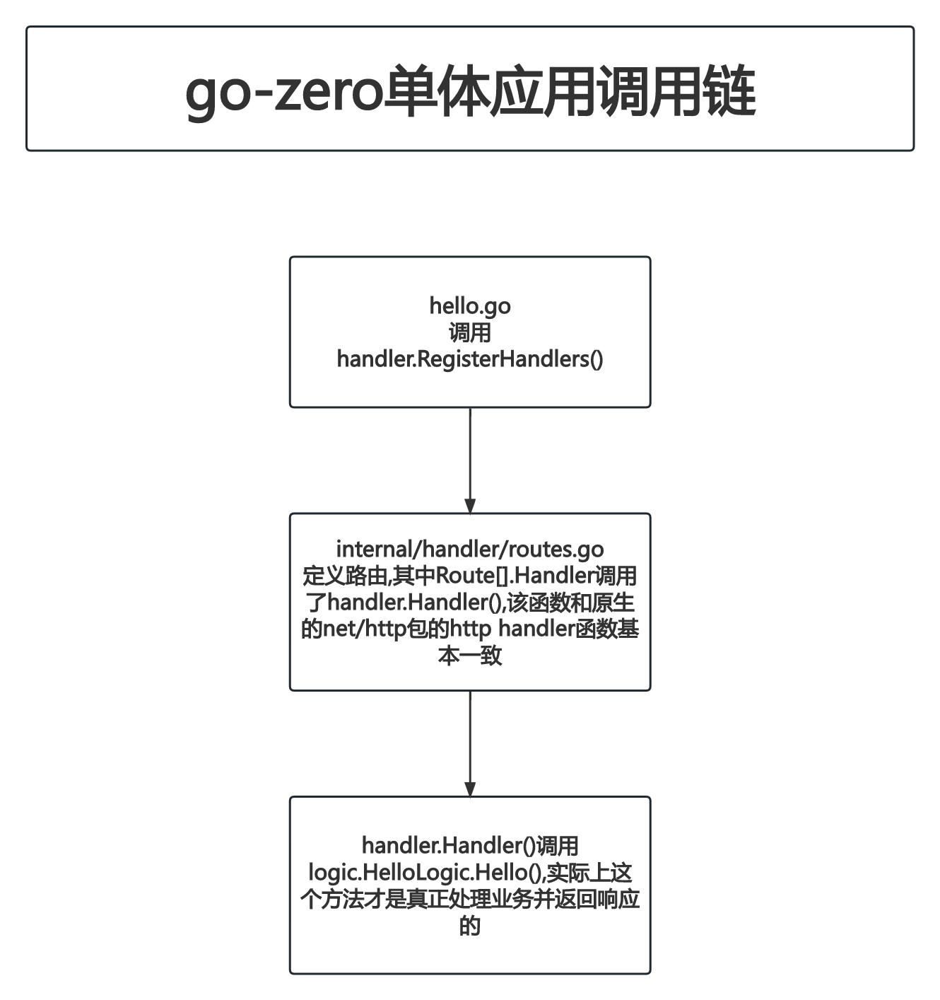

# 03-单体应用HelloWorld

## PART1. 安装goctl

注:读作go control

- step1. 安装goctl

```
go install github.com/zeromicro/go-zero/tools/goctl@v1.4.4
file $GOPATH/bin/goctl     
/myGoPath/bin/goctl: Mach-O 64-bit executable x86_64
```

- step2. 设置环境变量

```
vim ~/.bash_profile
cat ~/.bash_profile
```

```
...
export PATH=/Users/xxx/Desktop/myGoPath/bin:${PATH}
...
```

```
source ~/.bash_profile
```

## PART2. 安装protoc和protoc-gen-go

go-zero提供了便捷的安装方式:

```
goctl env check -i -f --verbose
```

## PART3. 单体服务版HelloWorld

- step1. 生成项目代码

```
(base) xxx@192 ~ % cd /Users/xxx/Desktop/go-zero-study/goZeroStudy/03-单体应用HelloWorld
(base) xxx@192 03-单体应用HelloWorld % 

(base) xxx@192 03-单体应用HelloWorld % mkdir helloworld
(base) xxx@192 03-单体应用HelloWorld % cd helloworld
(base) xxx@192 helloworld % goctl api new hello
Done.
(base) xxx@192 helloworld % cd hello 
(base) xxx@192 hello % go mod tidy
```

- step2. 工程目录说明

```
(base) xxx@192 hello % pwd
/Users/xxx/Desktop/go-zero-study/goZeroStudy/03-单体应用HelloWorld/helloworld/hello
(base) xxx@192 hello % tree ./ 
./
├── etc
│   └── hello-api.yaml
├── go.mod
├── go.sum
├── hello.api								// go-zero特有的文件格式
├── hello.go
└── internal
    ├── config
    │   └── config.go
    ├── handler
    │   ├── hellohandler.go
    │   └── routes.go
    ├── logic
    │   └── hellologic.go
    ├── svc
    │   └── servicecontext.go
    └── types
        └── types.go

7 directories, 11 files
```

其中`hello/hello.api`是go-zero特有的文件格式,用于生成代码.

- step3. 修改`hello/internal/handler/routes.go`的代码

修改前的`hello/internal/handler/routes.go`格式如下:

```go
// Code generated by goctl. DO NOT EDIT.
package handler

import (
	"net/http"

	"hello/internal/svc"

	"github.com/zeromicro/go-zero/rest"
)

func RegisterHandlers(server *rest.Server, serverCtx *svc.ServiceContext) {
	server.AddRoutes(
		[]rest.Route{
			{
				Method:  http.MethodGet,
				Path:    "/from/:name",
				Handler: HelloHandler(serverCtx),
			},
		},
	)
}
```

将其中的`/from/:name`修改为`/hello`

修改后的`hello/internal/handler/routes.go`格式如下:

```go
// Code generated by goctl. DO NOT EDIT.
package handler

import (
	"net/http"

	"hello/internal/svc"

	"github.com/zeromicro/go-zero/rest"
)

func RegisterHandlers(server *rest.Server, serverCtx *svc.ServiceContext) {
	server.AddRoutes(
		[]rest.Route{
			{
				Method:  http.MethodGet,
				Path:    "/hello",
				Handler: HelloHandler(serverCtx),
			},
		},
	)
}
```

注1:实际上这玩意儿应该是改某个元代码(代码之代码)再重新生成的,但是此时我还不知道这个事儿咋干.

注2:很明显`/from/:name`中的`:name`是表示路由参数的

- step4. 查看`hello/internal/handler/hellohandler.go`

```go
package handler

import (
	"net/http"

	"github.com/zeromicro/go-zero/rest/httpx"
	"hello/internal/logic"
	"hello/internal/svc"
	"hello/internal/types"
)

func HelloHandler(svcCtx *svc.ServiceContext) http.HandlerFunc {
	return func(w http.ResponseWriter, r *http.Request) {
		var req types.Request
		if err := httpx.Parse(r, &req); err != nil {
			httpx.ErrorCtx(r.Context(), w, err)
			return
		}

		l := logic.NewHelloLogic(r.Context(), svcCtx)
		resp, err := l.Hello(&req)
		if err != nil {
			httpx.ErrorCtx(r.Context(), w, err)
		} else {
			httpx.OkJsonCtx(r.Context(), w, resp)
		}
	}
}
```

明显这个就和go处理http请求的代码就很像了.

- step5. 查看`hello/internal/types/types.go`

```go
// Code generated by goctl. DO NOT EDIT.
package types

type Request struct {
	Name string `path:"name,options=you|me"`
}

type Response struct {
	Message string `json:"message"`
}
```

将`Request`.`Name`字段注释掉.因为我们在step3中将路由修改了.导致无法接收到这个参数了

修改后的`hello/internal/types/types.go`

```go
// Code generated by goctl. DO NOT EDIT.
package types

type Request struct {
	//Name string `path:"name,options=you|me"`
}

type Response struct {
	Message string `json:"message"`
}
```

注:实际上这玩意儿应该也是改某个元代码(代码之代码)再重新生成的

- step6. 修改`hello/internal/logic/hellologic.go`

修改前的`hello/internal/logic/hellologic.go`:

```go
package logic

import (
	"context"

	"hello/internal/svc"
	"hello/internal/types"

	"github.com/zeromicro/go-zero/core/logx"
)

type HelloLogic struct {
	logx.Logger
	ctx    context.Context
	svcCtx *svc.ServiceContext
}

func NewHelloLogic(ctx context.Context, svcCtx *svc.ServiceContext) *HelloLogic {
	return &HelloLogic{
		Logger: logx.WithContext(ctx),
		ctx:    ctx,
		svcCtx: svcCtx,
	}
}

func (l *HelloLogic) Hello(req *types.Request) (resp *types.Response, err error) {
	// todo: add your logic here and delete this line
	
	return
}
```

实际上此处的`HelloLogic.Hello()`方法,就是写逻辑的地方

修改后的`hello/internal/logic/hellologic.go`:

```go
package logic

import (
	"context"

	"hello/internal/svc"
	"hello/internal/types"

	"github.com/zeromicro/go-zero/core/logx"
)

type HelloLogic struct {
	logx.Logger
	ctx    context.Context
	svcCtx *svc.ServiceContext
}

func NewHelloLogic(ctx context.Context, svcCtx *svc.ServiceContext) *HelloLogic {
	return &HelloLogic{
		Logger: logx.WithContext(ctx),
		ctx:    ctx,
		svcCtx: svcCtx,
	}
}

func (l *HelloLogic) Hello(req *types.Request) (resp *types.Response, err error) {
	// todo: add your logic here and delete this line
	resp = &types.Response{Message: "Hello Go Zero"}
	return
}
```

- step7. 运行

```
(base) xxx@192 hello % go run hello.go -f ./etc/hello-api.yaml
Starting server at 0.0.0.0:8888...
```

- step8. 测试

```
(base) xxx@192 hello % curl localhost:8888/hello
{"message":"Hello Go Zero"}
```

## PART4. 一些思考

### 4.1 调用链



### 4.2 日志

根据我的观察,似乎go-zero和go-micro不同之处在于,它好像自己就做了监控指标采集了,不需要集成exporter,这个后边等成型了需要查