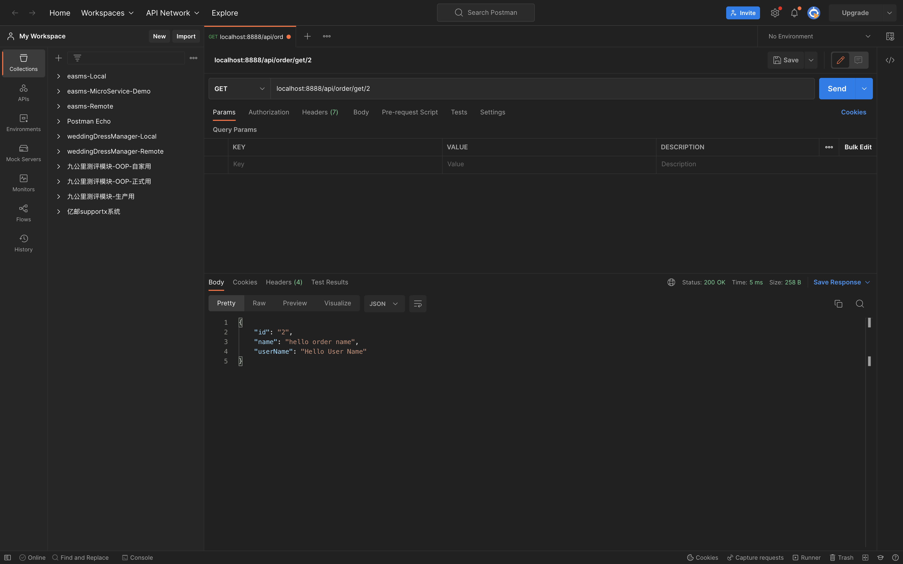

# 04-微服务版HelloWorld

## PART1. 情景

假设开发电商平台,那么需要一个订单服务和用户服务.本小节主要演示的是RPC调用,因为API层实际上和上一节的HelloWorld没什么不同.

## PART2. 创建项目并设置工作区

### 2.1 创建项目

```
(base) xxx@192 mall % pwd
/Users/xxx/Desktop/go-zero-study/goZeroStudy/04-微服务版HelloWorld/mall
(base) xxx@192 mall % goctl api new order	# 创建order微服务
Done.
(base) xxx@192 mall % goctl api new user 	# 创建user微服务
Done.
(base) xxx@192 mall % tree ./ -L 1
./
├── order
└── user

2 directories, 0 files
```

### 2.2 设置工作区

#### 2.2.1 问题背景

moduleA依赖moduleB,假设moduleB有更新(甚至更狭隘的限制:moduleB尚未被推送至repo),那么此时在moduleA下进行`go run`或`go tidy`,都会失败.

报错原因肯定是因为没有找到moduleB(我们以更狭隘的限制来凸显问题),那么问题来了:GO的依赖必须要上传到repo,和repo强绑定吗?

#### 2.2.2 工作区

GO1.18中增加了工作区的概念,针对的目标即为Go Module的依赖管理模式.通过引入一个`go.work`文件来开启GO工作区模式.**`go.work`通过directory指示符设置一些本地路径,这些路径下的Go Module构成一个工作区(workspace),GO命令可以操作这些路径下的Go Module,也会优先使用工作区中的Go Module.**

即:当本地有很多module,且这些module存在相互依赖时,那么我们可以在这些module外建立一个GO工作区,使用这个GO工作区,开发和调试这些module就变得十分方便.

#### 2.2.3 常用命令

- `go work init`:初始化工作区(注:通常情况下,建议不要提交`go.work`文件到`git`上,因为它主要用于本地代码开发)
- `go work use /foo/bar`:添加新的模块到工作区
- `go work edit`:编辑`go.work`文件

	- `go work edit -fmt go.work`:重新格式化`go.work`文件
	- `go work edit -replace=github.com/foo/bar=./foo/bar go.work`:替换代码模块
	- `go work edit -dropreplace=github.com/foo/bar`:删除替换代码模块
	- `go work edit -use=./example go.work`:添加新的模块到工作区
	- `go work edit -dropuse=./example go.work`:从工作区中删除模块

- `go work sync`:将工作区的构建列表同步到工作区的模块

#### 2.2.4 创建工作区

```
(base) xxx@192 mall % pwd
/Users/xxx/Desktop/go-zero-study/goZeroStudy/04-微服务版HelloWorld/mall
(base) xxx@192 mall % go work init
(base) xxx@192 mall % tree ./ -L 1
./
├── go.work
├── order
└── user

2 directories, 1 file
(base) xxx@192 mall % go work use ./order 
(base) xxx@192 mall % go work use ./user
```

## PART3. 编写User rpc服务

此处我们假定user只需启一个gRPC服务,供order调用即可

### 3.1 创建rpc目录

```
(base) xxx@192 mall % cd user 
(base) xxx@192 user % mkdir rpc
(base) xxx@192 user % tree ./ -L 1
./
├── etc
├── go.mod
├── internal
├── rpc
├── user.api
└── user.go

3 directories, 3 files
```

### 3.2 定义proto

```
(base) xxx@192 user % cat ./proto/user.proto
```

```proto 
syntax = "proto3";

package user;

// protoc-gen-go 版本大于1.4.0, proto文件需要加上go_package,否则无法生成
option go_package = "./user";

message IdRequest {
  string id = 1;
}

message UserResponse {
  // 用户id
  string id = 1;
  // 用户名称
  string name = 2;
  // 用户性别
  string gender = 3;
}

service User {
  rpc getUser(IdRequest) returns(UserResponse);
}
```

### 3.3 生成GO代码

```
(base) xxx@192 user % cd rpc 
(base) xxx@192 rpc % goctl rpc protoc user.proto --go_out=./types --go-grpc_out=./types --zrpc_out=.
Done.
```

```
(base) xxx@192 rpc % tree ./ -L 1
./
├── etc
├── internal
├── types
├── user.go
├── user.proto
└── userclient

4 directories, 2 files
```

可以看到,生成后的目录结构,几乎和上层目录是相同的.实际上由于我们刚刚创建User模块时,是以`goctl api new user`的方式生成的,但此处我们的需求是要一个rpc服务,所以只需要把`/user`下除`/user/rpc`目录和`go.mod`外所有的文件和文件夹都删除,再把`/user/rpc`下除`user.proto`外的所有文件都移出来就可以了

完成后的文件目录:

```
(base) xxx@192 rpc % cd ..
(base) xxx@192 user % tree ./ -L 1
./
├── etc
├── go.mod
├── internal
├── rpc
├── types
├── user.go
└── userclient

5 directories, 2 files
```

注:此处移动后的结果应该是:除了`/user/rpc`目录和`go.mod`外,所有文件均是从`/user/rpc`目录移动而来

### 3.4 加载依赖

```
(base) xxx@192 user % go mod tidy
...
go: downloading github.com/onsi/ginkgo/v2 v2.4.0
```

### 3.5 简单的介绍代码结构

`/user/types/user/user_grpc.pb.go`中定义了接口`UserServer`,`/user/internal/server/userserver.go`中的结构体`UserServer`是该接口的实现.和`go-micro`中的handler层需要实现`foo.pb.micro.go`中定义的接口`FooHandler`的套路是一样的.

写逻辑肯定还是在`/user/internal/logic/`中去写.

### 3.6 填充逻辑

`/user/internal/logic/getuserlogic.go`:

```go
package logic

import (
	"context"
	"user/internal/svc"
	"user/types/user"

	"github.com/zeromicro/go-zero/core/logx"
)

type GetUserLogic struct {
	ctx    context.Context
	svcCtx *svc.ServiceContext
	logx.Logger
}

func NewGetUserLogic(ctx context.Context, svcCtx *svc.ServiceContext) *GetUserLogic {
	return &GetUserLogic{
		ctx:    ctx,
		svcCtx: svcCtx,
		Logger: logx.WithContext(ctx),
	}
}

func (l *GetUserLogic) GetUser(in *user.IdRequest) (*user.UserResponse, error) {
	// todo: add your logic here and delete this line

	return &user.UserResponse{
		Id:     in.Id,
		Name:   "Hello User Name",
		Gender: "male",
	}, nil
}
```

实际上就是把返回值给填充了一下.至此,User rpc服务开发完成.

## PART4. 编写Order api服务

### 4.1 编写`order.api`

正规的流程也应该是根据`.api`文件去生成代码

修改后的`order/order.api`:

```api
type Request {
	Name string `path:"name,options=you|me"`
}

type Response {
	Message string `json:"message"`
}

type(
	OrderReq {
		Id string `path:"id"`
	}

	OrderReply {
		Id string `json:"id"`
		Name string `json:"name"`
		UserName string `json:"userName"`
	}
)

service order-api {
	@handler OrderHandler
	get /from/:name(Request) returns (Response)
	@handler GetOrder
    get /api/order/get/:id (OrderReq) returns (OrderReply)
}
```

### 4.2 根据`order.api`生成代码

```
(base) xxx@192 user % cd ..
(base) xxx@192 mall % cd order 
(base) xxx@192 order % goctl api go -api order.api -dir ./gen
Done.
```

注:

- `-api`参数:指定api文件的路径
- `-dir`参数:指定生成的代码存放的路径

此处由于避免生成的代码覆盖掉已有的代码,故暂存到`./gen`目录下,确认没有问题再覆盖

```    
(base) xxx@192 order % tree ./
./
├── etc
│   └── order-api.yaml
├── gen
│   ├── etc
│   │   └── order-api.yaml
│   ├── internal
│   │   ├── config
│   │   │   └── config.go
│   │   ├── handler
│   │   │   ├── getorderhandler.go
│   │   │   ├── orderhandler.go
│   │   │   └── routes.go
│   │   ├── logic
│   │   │   ├── getorderlogic.go
│   │   │   └── orderlogic.go
│   │   ├── svc
│   │   │   └── servicecontext.go
│   │   └── types
│   │       └── types.go
│   └── order.go
├── go.mod
├── internal
│   ├── config
│   │   └── config.go
│   ├── handler
│   │   ├── orderhandler.go
│   │   └── routes.go
│   ├── logic
│   │   └── orderlogic.go
│   ├── svc
│   │   └── servicecontext.go
│   └── types
│       └── types.go
├── order.api
└── order.go

15 directories, 20 files
```

可以看到,`/order/gen`目录下的文件结构和`/order`目录下的文件结构是完全相同的.直接拉出来全覆盖即可.记得最后把`/order/gen`删除

注:此处我们在`order.api`中新定义了一个handler,因此在`order/handler/`下也多了一个`getorderhandler.go`;在`order/logic/`下也多了一个`getorderlogic.go`.

### 4.3 新增配置

[go-zero rpc配置介绍](https://go-zero.dev/cn/docs/configuration/rpc/)

#### 4.3.1 修改配置文件

`order/etc/order-api.yaml`

```
Name: order-api
Host: 0.0.0.0
Port: 8888
UserRpc:
  # 指定注册中心的类型
  Etcd:
    # 指定注册中心的IP地址和端口
    Hosts:
      - 127.0.0.1:2379
    # 指定要查询的key 此处的key是user rpc服务中
    # 配置文件中 Key字段的值
    Key: user.rpc
```

#### 4.3.2 在配置结构体中新增配置字段

`order/internal/config/config.go`:

```go
package config

import (
	"github.com/zeromicro/go-zero/rest"
	"github.com/zeromicro/go-zero/zrpc"
)

type Config struct {
	rest.RestConf
	// UserRpc user rpc服务的配置
	// 即:order-api.yaml中的 UserRpc字段下的配置项
	UserRpc zrpc.RpcClientConf
}
```

很明显,由于在配置文件中新增了一个`UserRpc`字段的配置,需要在对应解析配置的结构体中新增对这个字段的定义

#### 4.3.3 建立连接

`order/internal/svc/servicecontext.go`:

```go
package svc

import (
	"github.com/zeromicro/go-zero/zrpc"
	"order/internal/config"
	"user/userclient"
)

type ServiceContext struct {
	Config config.Config
	// UserRpc 实际上是user模块中的userclient/user.go中定义的接口User
	UserRpc userclient.User
}

func NewServiceContext(c config.Config) *ServiceContext {
	return &ServiceContext{
		Config: c,
		// 其实userclient.NewUser()函数返回的接口User的实现 就是user/types/user_grpc.pb.go中定义的接口UserClient
		UserRpc: userclient.NewUser(zrpc.MustNewClient(c.UserRpc)),
	}
}
```

### 4.4 填充逻辑

`order/internal/logic/getorderlogic.go`:

```go
package logic

import (
	"context"
	"order/internal/svc"
	"order/internal/types"
	"user/types/user"

	"github.com/zeromicro/go-zero/core/logx"
)

type GetOrderLogic struct {
	logx.Logger
	ctx    context.Context
	svcCtx *svc.ServiceContext
}

func NewGetOrderLogic(ctx context.Context, svcCtx *svc.ServiceContext) *GetOrderLogic {
	return &GetOrderLogic{
		Logger: logx.WithContext(ctx),
		ctx:    ctx,
		svcCtx: svcCtx,
	}
}

func (l *GetOrderLogic) GetOrder(req *types.OrderReq) (resp *types.OrderReply, err error) {
	// todo: add your logic here and delete this line
	userId := req.Id
	getUserRequest := &user.IdRequest{Id: userId}
	// rpc调用user.GetUser
	userResp, err := l.svcCtx.UserRpc.GetUser(context.Background(), getUserRequest)
	if err != nil {
		return nil, err
	}

	resp = &types.OrderReply{
		Id:       req.Id,
		Name:     "hello order name",
		UserName: userResp.Name,
	}

	return resp, nil
}
```

至此,order api服务开发完成.

## PART5. 启动ETCD

```
docker run -d -p 2379:2379 -p 4001:4001 quay.io/coreos/etcd
```

## PART6. 测试



## PART7. 问题

1. proto我不熟,大概就知道怎么写能有啥效果,这个后边需要抽几天时间补一下
2. 实际上这个就是api层和service层,理论上来讲这个例子中,应该还有个order rpc服务