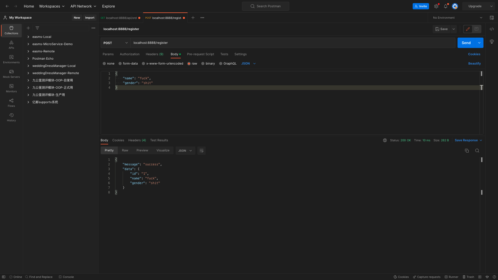

# 05-集成MySQL数据库

## PART1. 环境准备

在MySQL中创建数据库`zero_mall`

## PART2. 添加配置

此处我们继续用前一小节开发的mall系统,在user模块中添加对MySQL的调用

### 2.1 创建目录

在`user/internal`下创建目录`model`

```
(base) xxx@192 user % cd internal 
(base) xxx@192 internal % tree ./ -L 1
./
├── config
├── logic
├── model
├── server
└── svc

5 directories, 0 files
```

### 2.2 创建sql语句文件

创建文件`/usr/internal/model/user.sql`,其内容如下:

```sql
CREATE TABLE `user` (
  `id` int(11) unsigned NOT NULL AUTO_INCREMENT,
  `name` varchar(255) DEFAULT NULL,
  `gender` varchar(255) DEFAULT NULL,
  PRIMARY KEY (`id`)
) ENGINE=InnoDB DEFAULT CHARSET=utf8;
```

此处主要是为了使用goctl工具生成一些代码([model生成](https://go-zero.dev/cn/docs/advance/model-gen))

### 2.3 生成代码

```
(base) xxx@192 internal % cd model 
(base) xxx@192 model % goctl model mysql ddl -src user.sql -dir . -c
Done.
```

生成的代码:

```
(base) xxx@192 user % cd internal/model 
(base) xxx@192 model % tree ./ -L 1
./
├── user.sql
├── usermodel.go
├── usermodel_gen.go
└── vars.go

0 directories, 4 files
```

可以看到,`usermodel.go`、`usermodel_gen.go`、`vars.go`都是生成出来的.本例中,我们并没有使用到这些代码.

### 2.4 定义模型

创建文件`user/internal/model/user.go`,其内容如下:

```go
package model

import "database/sql"

type User struct {
	Id     int64          `db:"id"`
	Name   sql.NullString `db:"name"`
	Gender sql.NullString `db:"gender"`
}
```

然后删除`usermodel_gen.go`中对于`User`结构体的定义

### 2.5 定义接口

创建目录`user/internal/repo`,在该目录下创建文件`user.go`,其内容如下:

```go
package repo

import (
	"context"
	"user/internal/model"
)

type UserRepo interface {
	Save(ctx context.Context, user *model.User) error
}
```

可以看到,这一步定义了存储接口.接下来必然是要定义它的实现

### 2.6 定义实现

创建目录`user/internal/dao`,在该目录下创建文件`user.go`,其内容如下:

```go
package dao

import (
	"context"
	"user/internal/model"
)

type UserDao struct {
}

func NewUserDao() *UserDao {
	return &UserDao{}
}

func (u *UserDao) Save(ctx context.Context, user *model.User) error {
	return nil
}
```

### 2.7 添加依赖资源

`user/internal/svc/servicecontext.go`中,定义了结构体`ServiceContext`,该结构体表示logic层依赖的资源池.因此我们定义的接口`UserRepo`,就需要添加到这个资源池中.

修改后的`user/internal/svc/servicecontext.go`:

```go
package svc

import (
	"user/internal/config"
	"user/internal/dao"
	"user/internal/repo"
)

type ServiceContext struct {
	Config config.Config
	UserRepo repo.UserRepo
}

func NewServiceContext(c config.Config) *ServiceContext {
	return &ServiceContext{
		Config: c,
		UserRepo: dao.NewUserDao(),
	}
}
```

### 2.8 创建数据库连接结构体

创建目录`user/database`

注:实际上`database`目录也可以创建在`user/internal/`下.user作为一个rpc服务,被外部引用时,`user/internal/`下的代码是无法被外部调用到的.但也是因为user是一个rpc服务,所以不会被其他服务依赖,对端只需要通过rpc远程调用即可.

可以认为`user/internal`是写一些核心逻辑代码的地方,而`user/database`,首先它是个连接配置,不算核心代码;其次还是因为它是个连接配置,所以它有一些参数可能是需要改变的(例如数据库的用户名/密码),放在`user/internal`下,不那么合适,所以直接放在`user`下

创建文件`user/database/sqlx.go`:

```go
package database

import "github.com/zeromicro/go-zero/core/stores/sqlx"

type DBConn struct {
	Conn sqlx.SqlConn
}

func Connect(dataSource string) *DBConn {
	return &DBConn{Conn: sqlx.NewMysql(dataSource)}
}
```

本例中我们使用的是go-zero自带的ORM.很明显,这里我们需要提供连接MySQL所需的参数,从代码中来看就是形参`dataSource`.

### 2.9 添加连接配置

#### 2.9.1 向配置结构体中添加字段

`user/internal/config/config.go`:

```go
package config

import "github.com/zeromicro/go-zero/zrpc"

type Config struct {
	zrpc.RpcServerConf
	MySQL MySQLConfig
}

type MySQLConfig struct {
	DataSource string
}
```

可以看到添加了`MySQL`字段,其类型为`MySQLConfig`

#### 2.9.2 向配置文件中添加连接MySQL所需信息

`user/etc/user.yaml`:

```yaml
Name: user.rpc
ListenOn: 0.0.0.0:8080
Etcd:
  Hosts:
  - 127.0.0.1:2379
  Key: user.rpc
MySQL:
  DataSource: root:123456@tcp(127.0.0.1:3306)/zero_mall?charset=utf8&parseTime=true&loc=Local
```

#### 2.9.3 添加连接

- step1. 在dao层添加连接

`user/internal/dao/user.go`:

```go
package dao

import (
	"context"
	"user/database"
	"user/internal/model"
)

type UserDao struct {
	Conn *database.DBConn
}

func NewUserDao(conn *database.DBConn) *UserDao {
	return &UserDao{
		Conn: conn,
	}
}

func (u *UserDao) Save(ctx context.Context, user *model.User) error {
	return nil
}
```

- step2. 资源池调用`NewUserDao()`时传递连接参数

`user/internal/svc/servicecontext.go`:

```go
package svc

import (
	"user/database"
	"user/internal/config"
	"user/internal/dao"
	"user/internal/repo"
)

type ServiceContext struct {
	Config   config.Config
	UserRepo repo.UserRepo
}

func NewServiceContext(c config.Config) *ServiceContext {
	return &ServiceContext{
		Config:   c,
		UserRepo: dao.NewUserDao(database.Connect(c.MySQL.DataSource)),
	}
}
```

## PART3. 操作DB

- step1. 定义表名

`user/internal/model/user.go`:

```go
package model

import "database/sql"

type User struct {
	Id     int64          `db:"id"`
	Name   sql.NullString `db:"name"`
	Gender sql.NullString `db:"gender"`
}

func (u *User) TableName() string {
	return "user"
}
```

- step2. 实现`Save()`方法

`user/internal/dao/user.go`:

```go
package dao

import (
	"context"
	"fmt"
	"user/database"
	"user/internal/model"
)

type UserDao struct {
	Conn *database.DBConn
}

func NewUserDao(conn *database.DBConn) *UserDao {
	return &UserDao{
		Conn: conn,
	}
}

func (u *UserDao) Save(ctx context.Context, user *model.User) error {
	sql := fmt.Sprintf("INSERT INTO %s (`name`, `gender`) VALUES (?, ?)", user.TableName())
	result, err := u.Conn.Conn.ExecCtx(ctx, sql, user.Name.String, user.Gender.String)
	if err != nil {
		return err
	}

	id, err := result.LastInsertId()
	if err != nil {
		return err
	}

	user.Id = id
	return nil
}

```

## PART4. 实现逻辑

- step1. 编辑proto文件,添加一个rpc服务

`user/rpc/user.proto`:

```proto
syntax = "proto3";

package user;

// protoc-gen-go 版本大于1.4.0, proto文件需要加上go_package,否则无法生成
option go_package = "./user";

message IdRequest {
  string id = 1;
}

message UserResponse {
  // 用户id
  string id = 1;
  // 用户名称
  string name = 2;
  // 用户性别
  string gender = 3;
}

message UserRequest {
  // 用户id
  string id = 1;
  // 用户名称
  string name = 2;
  // 用户性别
  string gender = 3;
}

service User {
  rpc getUser(IdRequest) returns(UserResponse);
  rpc saveUser(UserRequest) returns(UserResponse);
}
```

- step2. 根据proto重新生成go代码

创建文件`user/rpc/gen.sh`,其内容如下:

```shell
goctl rpc protoc user.proto --go_out=./types --go-grpc_out=./types --zrpc_out=.
```

执行:

```
(base) xxx@192 user % pwd
/Users/xxx/Desktop/go-zero-study/goZeroStudy/05-集成MySQL数据库/mall/user
(base) xxx@192 user % cd ./rpc 
(base) xxx@192 rpc % chmod +x gen.sh 
(base) xxx@192 rpc % ./gen.sh 
Done.
```

此时在`user/rpc/`目录下又生成了和`user/`相同的目录结构.

1. 将`user/rpc/types/user/`下的`user.pb.go`和`user_grpc.pb.go`复制到`user/types/user/`下,覆盖同名文件
2. 将`user/rpc/userclient/`下的`user.go`复制到`user/userclient/`下,覆盖同名文件.覆盖后将`import`部分中的`"user/rpc/types/user"`修改为`"user/types/user"`
3. 将`user/rpc/internal/server/`下的`userserver.go`复制到`user/internal/server/`下,覆盖同名文件.覆盖后将`import`部分中的`"user/rpc/internal/logic"`修改为`"user/internal/logic"`;将`"user/rpc/types/user"`修改为`"user/types/user"`;将`"user/rpc/types/user"`修改为`"user/types/user"`
4. 将`user/rpc/internal/logic`下的`saveuserlogic.go`复制到`user/internal/logic`下.复制后将将`import`部分中的`"user/rpc/internal/svc"`修改为`"user/internal/svc"`;将`"user/rpc/types/user"`修改为`"user/types/user"`
5. 其他文件删除(即:`user/rpc`下只保留`user.proto`和`gen.sh`)

- step3. 实现逻辑

`user/internal/logic/saveuserlogic.go`:

```go
package logic

import (
	"context"
	"database/sql"
	"strconv"
	"user/internal/model"

	"user/internal/svc"
	"user/types/user"

	"github.com/zeromicro/go-zero/core/logx"
)

type SaveUserLogic struct {
	ctx    context.Context
	svcCtx *svc.ServiceContext
	logx.Logger
}

func NewSaveUserLogic(ctx context.Context, svcCtx *svc.ServiceContext) *SaveUserLogic {
	return &SaveUserLogic{
		ctx:    ctx,
		svcCtx: svcCtx,
		Logger: logx.WithContext(ctx),
	}
}

func (l *SaveUserLogic) SaveUser(in *user.UserRequest) (*user.UserResponse, error) {
	// todo: add your logic here and delete this line
	ctx := context.Background()
	userModel := &model.User{
		Name: sql.NullString{
			String: in.Name,
		},
		Gender: sql.NullString{
			String: in.Gender,
		},
	}
	err := l.svcCtx.UserRepo.Save(ctx, userModel)
	if err != nil {
		return nil, err
	}
	respId := strconv.FormatInt(userModel.Id, 10)
	return &user.UserResponse{
		Id:     respId,
		Name:   in.Name,
		Gender: in.Gender,
	}, nil
}
```

至此,user rpc服务开发完成.

## PART5. 访问SaveUser rpc服务

### 5.1 创建user api服务

- step1. 创建工程

```
(base) xxx@192 mall % pwd                  
/Users/xxx/Desktop/go-zero-study/goZeroStudy/05-集成MySQL数据库/mall
(base) xxx@192 mall % goctl api new userapi
Done.
```

- step2. 创建`go.mod`文件

`userapi/go.mod`:

```
module userapi

go 1.18
```

- step3. 添加userapi至work space

```
(base) xxx@192 mall % pwd
/Users/xxx/Desktop/go-zero-study/goZeroStudy/05-集成MySQL数据库/mall
(base) xxx@192 mall % go work use ./userapi 
```

- step4. 在`userapi/`目录下执行`go mod tidy`

```
(base) xxx@192 mall % cd userapi 
(base) xxx@192 userapi % go mod tidy
go: finding module for package github.com/zeromicro/go-zero/core/conf
...
go: found github.com/zeromicro/go-zero/core/logx in github.com/zeromicro/go-zero v1.5.0
```

### 5.2 修改配置文件

`userapi/etc/userapi-api.yaml`:

```yaml
Name: userapi-api
Host: 0.0.0.0
Port: 8888
UserRpc:
  # 指定注册中心的类型
  Etcd:
    # 指定注册中心的IP地址和端口
    Hosts:
      - 127.0.0.1:2379
    # 指定要查询的key 此处的key是user rpc服务中
    # 配置文件中 Key字段的值
    Key: user.rpc
```

### 5.3 修改入口文件

此处的修改是因为goctl工具有点问题,生成的代码中,import部分有点问题

修改后的`userapi/userapi.go`:

```go
package main

import (
	"flag"
	"fmt"

	"userapi/internal/config"		# 此处有修改
	"userapi/internal/handler"		# 此处有修改
	"userapi/internal/svc"			# 此处有修改

	"github.com/zeromicro/go-zero/core/conf"
	"github.com/zeromicro/go-zero/rest"
)

var configFile = flag.String("f", "etc/userapi-api.yaml", "the config file")

func main() {
	flag.Parse()

	var c config.Config
	conf.MustLoad(*configFile, &c)

	server := rest.MustNewServer(c.RestConf)
	defer server.Stop()

	ctx := svc.NewServiceContext(c)
	handler.RegisterHandlers(server, ctx)

	fmt.Printf("Starting server at %s:%d...\n", c.Host, c.Port)
	server.Start()
}
```

### 5.4 修改配置结构体

`userapi/internal/config/config.go`:

```go
package config

import (
	"github.com/zeromicro/go-zero/rest"
	"github.com/zeromicro/go-zero/zrpc"
)

type Config struct {
	rest.RestConf
	UserRpc zrpc.RpcClientConf
}
```

### 5.5 建立连接

`userapi/internal/svc/servicecontext.go`:

```go
package svc

import (
	"github.com/zeromicro/go-zero/zrpc"
	"user/userclient"
	"userapi/internal/config"
)

type ServiceContext struct {
	Config  config.Config
	UserRpc userclient.User
}

func NewServiceContext(c config.Config) *ServiceContext {
	return &ServiceContext{
		Config:  c,
		UserRpc: userclient.NewUser(zrpc.MustNewClient(c.UserRpc)),
	}
}
```

### 5.6 修改类型定义

`userapi/internal/types/types.go`:

```go
// Code generated by goctl. DO NOT EDIT.
package types

type Request struct {
	Name string `json:"name"`
	Gender string `json:"gender"`
}

type Response struct {
	Message string `json:"message"`
	Data any `json:"data"`
}
```

### 5.7 填充逻辑

`userapi/internal/logic/userapilogic.go`:

```go
package logic

import (
	"context"
	"time"
	"user/types/user"

	"userapi/internal/svc"
	"userapi/internal/types"

	"github.com/zeromicro/go-zero/core/logx"
)

type UserapiLogic struct {
	logx.Logger
	ctx    context.Context
	svcCtx *svc.ServiceContext
}

func NewUserLogic(ctx context.Context, svcCtx *svc.ServiceContext) *UserapiLogic {
	return &UserapiLogic{
		Logger: logx.WithContext(ctx),
		ctx:    ctx,
		svcCtx: svcCtx,
	}
}

func (l *UserapiLogic) Userapi(req *types.Request) (resp *types.Response, err error) {
	// todo: add your logic here and delete this line

	return
}

func (l *UserapiLogic) Register(req *types.Request) (resp *types.Response, err error) {
	// todo: add your logic here and delete this line
	// 一般做超时上下文
	ctx, cancelFunc := context.WithTimeout(context.Background(), 5*time.Second)
	defer cancelFunc()
	saveReq := &user.UserRequest{
		Name:   req.Name,
		Gender: req.Gender,
	}
	saveResp, err := l.svcCtx.UserRpc.SaveUser(ctx, saveReq)
	if err != nil {
		return nil, err
	}
	resp = &types.Response{
		Message: "success",
		Data:    saveResp,
	}
	return resp, nil
}
```

可以看到,在`UserapiLogic.Register()`方法中,完成了对user rpc服务的调用.再次强调,此处代码中的`l.svcCtx.UserRpc`,就是在5.5章节中添加的`ServiceContext.UserRpc`

### 5.8 实现handler

在`userapi/internal/handler/`下新建文件`register.go`:

```go
package handler

import (
	"github.com/zeromicro/go-zero/rest/httpx"
	"net/http"
	"userapi/internal/logic"
	"userapi/internal/svc"
	"userapi/internal/types"
)

type UserHandler struct {
	SvcCtx *svc.ServiceContext
}

func (h *UserHandler) Register(w http.ResponseWriter, r *http.Request) {
	var req types.Request
	if err := httpx.ParseJsonBody(r, &req); err != nil {
		httpx.ErrorCtx(r.Context(), w, err)
		return
	}

	l := logic.NewUserLogic(r.Context(), h.SvcCtx)
	resp, err := l.Register(&req)
	if err != nil {
		httpx.ErrorCtx(r.Context(), w, err)
	} else {
		httpx.OkJsonCtx(r.Context(), w, resp)
	}
}

func NewUserHandler(svcCtx *svc.ServiceContext) *UserHandler {
	return &UserHandler{SvcCtx: svcCtx}
}
```

此处的`UserHandler.Register()`方法,实际上就是路由对应的处理函数.

### 5.9 修改路由

`userapi/internal/handler/routes.go`:

```go
// Code generated by goctl. DO NOT EDIT.
package handler

import (
	"net/http"

	"userapi/internal/svc"

	"github.com/zeromicro/go-zero/rest"
)

func RegisterHandlers(server *rest.Server, serverCtx *svc.ServiceContext) {
	handler := NewUserHandler(serverCtx)
	server.AddRoutes(
		[]rest.Route{
			{
				Method:  http.MethodPost,
				Path:    "/register",
				Handler: handler.Register,
			},
		},
	)
}
```

至此,就完成了对user rpc服务的调用.

## PART6. 测试




## PART7. 进阶

此处将`user/userclient/`和`user/types`这2个目录移走,移到一个公共的模块中,该模块中存储的是各个rpc服务的客户端连接和参数定义.这样做的好处在于:将api层与rpc层完全解耦.

### 7.1 创建工程目录和工作空间

#### 7.1 创建工作目录

```
(base) xxx@192 mall % pwd
/Users/xxx/Desktop/go-zero-study/goZeroStudy/05-集成MySQL数据库/mall
(base) xxx@192 mall % mkdir rpc-common
(base) xxx@192 mall % cd rpc-common 
(base) xxx@192 rpc-common % go mod init rpc-common
go: creating new go.mod: module rpc-common
(base) xxx@192 rpc-common % mkdir user
```

#### 7.2 创建work space

```
(base) xxx@192 mall % pwd
/Users/xxx/Desktop/go-zero-study/goZeroStudy/05-集成MySQL数据库/mall
(base) xxx@192 mall % go work use ./rpc-common
```

### 7.2 移动代码

将`user/userclient/`和`user/types`这2个目录移到`rpc-common/user`下

修改`rpc-common/user/userclient/user.go`:

```go
// Code generated by goctl. DO NOT EDIT.
// Source: user.proto

package userclient

import (
	"context"

	"rpc-common/user/types/user"	# 此处改了import的路径 其他地方无变化

	"github.com/zeromicro/go-zero/zrpc"
	"google.golang.org/grpc"
)

type (
	IdRequest    = user.IdRequest
	UserRequest  = user.UserRequest
	UserResponse = user.UserResponse

	User interface {
		GetUser(ctx context.Context, in *IdRequest, opts ...grpc.CallOption) (*UserResponse, error)
		SaveUser(ctx context.Context, in *UserRequest, opts ...grpc.CallOption) (*UserResponse, error)
	}

	defaultUser struct {
		cli zrpc.Client
	}
)

func NewUser(cli zrpc.Client) User {
	return &defaultUser{
		cli: cli,
	}
}

func (m *defaultUser) GetUser(ctx context.Context, in *IdRequest, opts ...grpc.CallOption) (*UserResponse, error) {
	client := user.NewUserClient(m.cli.Conn())
	return client.GetUser(ctx, in, opts...)
}

func (m *defaultUser) SaveUser(ctx context.Context, in *UserRequest, opts ...grpc.CallOption) (*UserResponse, error) {
	client := user.NewUserClient(m.cli.Conn())
	return client.SaveUser(ctx, in, opts...)
}
```

### 7.3 修改user rpc中对types的引用

#### 7.3.1 logic层对types的引用

##### a. `getuserlogic.go`

`/user/internal/logic/getuserlogic.go`:

```go
package logic

import (
	"context"
	"rpc-common/user/types/user" # 此处修改了import的路径
	"user/internal/svc"

	"github.com/zeromicro/go-zero/core/logx"
)

type GetUserLogic struct {
	ctx    context.Context
	svcCtx *svc.ServiceContext
	logx.Logger
}

func NewGetUserLogic(ctx context.Context, svcCtx *svc.ServiceContext) *GetUserLogic {
	return &GetUserLogic{
		ctx:    ctx,
		svcCtx: svcCtx,
		Logger: logx.WithContext(ctx),
	}
}

func (l *GetUserLogic) GetUser(in *user.IdRequest) (*user.UserResponse, error) {
	// todo: add your logic here and delete this line

	return &user.UserResponse{
		Id:     in.Id,
		Name:   "Hello User Name",
		Gender: "male",
	}, nil
}
```

##### b. `saveuserlogic.go`

`/user/internal/logic/saveuserlogic.go`:

```go
package logic

import (
	"context"
	"database/sql"
	"strconv"
	"user/internal/model"

	"rpc-common/user/types/user"
	"user/internal/svc"

	"github.com/zeromicro/go-zero/core/logx"
)

type SaveUserLogic struct {
	ctx    context.Context
	svcCtx *svc.ServiceContext
	logx.Logger
}

func NewSaveUserLogic(ctx context.Context, svcCtx *svc.ServiceContext) *SaveUserLogic {
	return &SaveUserLogic{
		ctx:    ctx,
		svcCtx: svcCtx,
		Logger: logx.WithContext(ctx),
	}
}

func (l *SaveUserLogic) SaveUser(in *user.UserRequest) (*user.UserResponse, error) {
	// todo: add your logic here and delete this line
	ctx := context.Background()
	userModel := &model.User{
		Name: sql.NullString{
			String: in.Name,
		},
		Gender: sql.NullString{
			String: in.Gender,
		},
	}
	err := l.svcCtx.UserRepo.Save(ctx, userModel)
	if err != nil {
		return nil, err
	}
	respId := strconv.FormatInt(userModel.Id, 10)
	return &user.UserResponse{
		Id:     respId,
		Name:   in.Name,
		Gender: in.Gender,
	}, nil
}
```

#### 7.3.2 server层对types的引用

`/user/internal/server/userserver.go`:

```go
// Code generated by goctl. DO NOT EDIT.
// Source: user.proto

package server

import (
	"context"

	"user/internal/logic"
	"user/internal/svc"
	"rpc-common/user/types/user"		# 此处修改了import的路径
)

type UserServer struct {
	svcCtx *svc.ServiceContext
	user.UnimplementedUserServer
}

func NewUserServer(svcCtx *svc.ServiceContext) *UserServer {
	return &UserServer{
		svcCtx: svcCtx,
	}
}

func (s *UserServer) GetUser(ctx context.Context, in *user.IdRequest) (*user.UserResponse, error) {
	l := logic.NewGetUserLogic(ctx, s.svcCtx)
	return l.GetUser(in)
}

func (s *UserServer) SaveUser(ctx context.Context, in *user.UserRequest) (*user.UserResponse, error) {
	l := logic.NewSaveUserLogic(ctx, s.svcCtx)
	return l.SaveUser(in)
}
```

#### 7.3.3 入口文件对types的引用

`user/user.go`:

```go
package main

import (
	"flag"
	"fmt"
	"rpc-common/user/types/user"		# 此处修改了import的路径
	"user/internal/config"
	"user/internal/server"
	"user/internal/svc"

	"github.com/zeromicro/go-zero/core/conf"
	"github.com/zeromicro/go-zero/core/service"
	"github.com/zeromicro/go-zero/zrpc"
	"google.golang.org/grpc"
	"google.golang.org/grpc/reflection"
)

var configFile = flag.String("f", "etc/user.yaml", "the config file")

func main() {
	flag.Parse()

	var c config.Config
	conf.MustLoad(*configFile, &c)
	ctx := svc.NewServiceContext(c)

	s := zrpc.MustNewServer(c.RpcServerConf, func(grpcServer *grpc.Server) {
		user.RegisterUserServer(grpcServer, server.NewUserServer(ctx))

		if c.Mode == service.DevMode || c.Mode == service.TestMode {
			reflection.Register(grpcServer)
		}
	})
	defer s.Stop()

	fmt.Printf("Starting rpc server at %s...\n", c.ListenOn)
	s.Start()
}
```

### 7.4 修改user api中对user rpc的调用

#### 7.4.1 修改rpc连接

`userapi/internal/svc/servicecontext.go`:

```go
package svc

import (
	"github.com/zeromicro/go-zero/zrpc"
	"rpc-common/user/userclient"		# 此处修改了import的路径
	"userapi/internal/config"
)

type ServiceContext struct {
	Config  config.Config
	UserRpc userclient.User
}

func NewServiceContext(c config.Config) *ServiceContext {
	return &ServiceContext{
		Config:  c,
		UserRpc: userclient.NewUser(zrpc.MustNewClient(c.UserRpc)),
	}
}
```

#### 7.4.2 修改rpc调用

`userapi/internal/logic/userapilogic.go`:

```go
package logic

import (
	"context"
	"rpc-common/user/types/user"		# 此处修改了import的路径
	"time"

	"userapi/internal/svc"
	"userapi/internal/types"

	"github.com/zeromicro/go-zero/core/logx"
)

type UserapiLogic struct {
	logx.Logger
	ctx    context.Context
	svcCtx *svc.ServiceContext
}

func NewUserLogic(ctx context.Context, svcCtx *svc.ServiceContext) *UserapiLogic {
	return &UserapiLogic{
		Logger: logx.WithContext(ctx),
		ctx:    ctx,
		svcCtx: svcCtx,
	}
}

func (l *UserapiLogic) Userapi(req *types.Request) (resp *types.Response, err error) {
	// todo: add your logic here and delete this line

	return
}

func (l *UserapiLogic) Register(req *types.Request) (resp *types.Response, err error) {
	// todo: add your logic here and delete this line
	// 一般做超时上下文
	ctx, cancelFunc := context.WithTimeout(context.Background(), 5*time.Second)
	defer cancelFunc()
	saveReq := &user.UserRequest{
		Name:   req.Name,
		Gender: req.Gender,
	}
	saveResp, err := l.svcCtx.UserRpc.SaveUser(ctx, saveReq)
	if err != nil {
		return nil, err
	}
	resp = &types.Response{
		Message: "success",
		Data:    saveResp,
	}
	return resp, nil
}
```