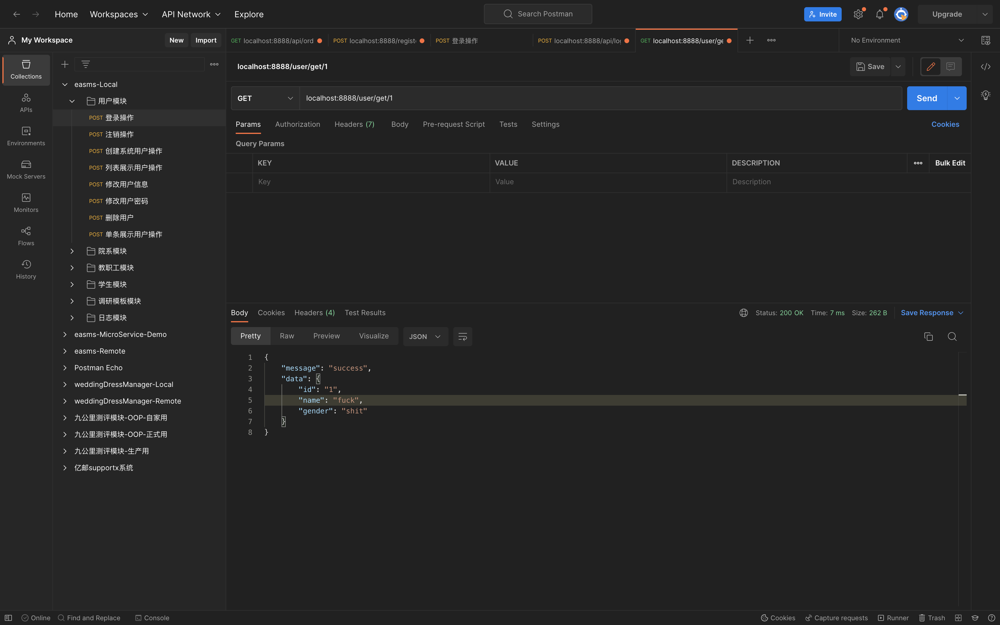
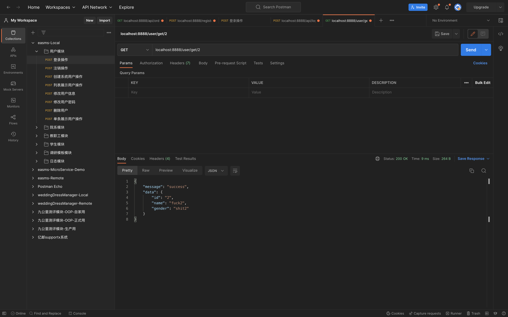
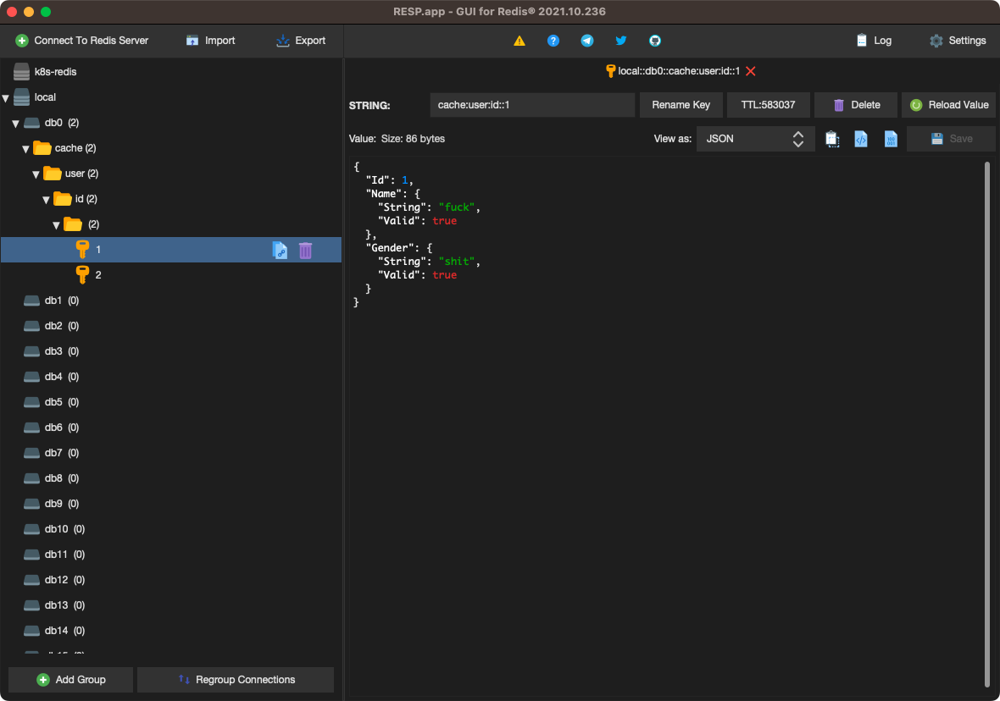

# 集成Redis

go-zero框架使用go-redis来连接redis.这个是内置的,可以在`go.mod`文件中找到.此处演示继续使用之前的mall项目.

## PART1. 在配置文件中添加配置

`user/etc/user.yaml`:

```yaml
Name: user.rpc
ListenOn: 0.0.0.0:8080
Etcd:
  Hosts:
  - 127.0.0.1:2379
  Key: user.rpc
MySQL:
  DataSource: root:123456@tcp(127.0.0.1:3306)/zero_mall?charset=utf8&parseTime=true&loc=Local
CacheRedis:
  - Host: 127.0.0.1:6379
    Type: node
```

注:配置的格式可以参考`cache.CacheConf`的结构体定义

## PART2. 在配置结构体中添加Redis配置

`user/internal/config/config.go`:

```go
package config

import (
	"github.com/zeromicro/go-zero/core/stores/cache"
	"github.com/zeromicro/go-zero/zrpc"
)

type Config struct {
	zrpc.RpcServerConf
	MySQL      MySQLConfig
	CacheRedis cache.CacheConf
}

type MySQLConfig struct {
	DataSource string
}
```

## PART3. 添加缓存连接

go-zero会将DB中的数据自动缓存到cache中.所以创建redis连接句柄时,会用到sqlx的连接.

`user/database/sqlx.go`:

```go
package database

import (
	"github.com/zeromicro/go-zero/core/stores/cache"
	"github.com/zeromicro/go-zero/core/stores/sqlc"
	"github.com/zeromicro/go-zero/core/stores/sqlx"
)

type DBConn struct {
	Conn      sqlx.SqlConn
	ConnCache sqlc.CachedConn
}

func Connect(dataSource string, conf cache.CacheConf) *DBConn {
	sqlConn := sqlx.NewMysql(dataSource)
	d := &DBConn{
		Conn: sqlConn,
	}

	// redis配置不为空 说明需要用缓存 再连接缓存
	if conf != nil {
		cachedConn := sqlc.NewConn(sqlConn, conf)
		d.ConnCache = cachedConn
	}
	return d
}
```

## PART4. 在service资源池中添加redis配置

`user/internal/svc/servicecontext.go`:

```go
package svc

import (
	"user/database"
	"user/internal/config"
	"user/internal/dao"
	"user/internal/repo"
)

type ServiceContext struct {
	Config   config.Config
	UserRepo repo.UserRepo
}

func NewServiceContext(c config.Config) *ServiceContext {
	return &ServiceContext{
		Config:   c,
		UserRepo: dao.NewUserDao(database.Connect(c.MySQL.DataSource, c.CacheRedis)),
	}
}
```

此处因为调用的函数`dao.NewUserDao()`形参发生了变化,所以调用时需要把表示redis配置的实参传过去.

## PART5. 实现一个从DB中查找的方法

### 5.1 repo层定义方法

`user/internal/repo/user.go`:

```go
package repo

import (
	"context"
	"user/internal/model"
)

type UserRepo interface {
	Save(ctx context.Context, user *model.User) error
	FindById(ctx context.Context, id int64) (*model.User, error)
}
```

### 5.2 dao层实现方法

`dao.User`作为`repo.UserRepo`的实现,需要实现`UserRepo.FindById()`方法.

`user/internal/dao/user.go`:

```go
package dao

import (
	"context"
	"fmt"
	"github.com/zeromicro/go-zero/core/stores/sqlx"
	"user/database"
	"user/internal/model"
)

// cacheUserIdPrefix 使用缓存时的key前缀
var cacheUserIdPrefix = "cache:user:id:"

type UserDao struct {
	Conn *database.DBConn
}

func NewUserDao(conn *database.DBConn) *UserDao {
	return &UserDao{
		Conn: conn,
	}
}

func (u *UserDao) Save(ctx context.Context, user *model.User) error {
	sql := fmt.Sprintf("INSERT INTO %s (`name`, `gender`) VALUES (?, ?)", user.TableName())
	result, err := u.Conn.Conn.ExecCtx(ctx, sql, user.Name.String, user.Gender.String)
	if err != nil {
		return err
	}

	id, err := result.LastInsertId()
	if err != nil {
		return err
	}

	user.Id = id
	return nil
}

func (u *UserDao) FindById(ctx context.Context, id int64) (user *model.User, err error) {
	user = &model.User{}
	sql := fmt.Sprintf("SELECT * FROM %s WHERE `id` = ?", user.TableName())
	// 数据在redis中的key名
	userIdKey := fmt.Sprintf("%s:%d", cacheUserIdPrefix, id)
	// 使用带有cache的连接
	err = u.Conn.ConnCache.QueryRowCtx(ctx, user, userIdKey, func(ctx context.Context, conn sqlx.SqlConn, v any) error {
		return conn.QueryRowCtx(ctx, v, sql, id)
	})

	return user, err
}
```

代码解读:

- 调用`u.Conn.ConnCache.QueryRowCtx()`时的参数:

	- `ctx`:上下文
	- `user`:实际上就是`&model.User{}`,执行查询后的结果将保存在这个对象中
	- `userIdKey`:查询结果在cache中缓存的key名
	- 匿名函数中调用`conn.QueryRowCtx()`参数:

		- `ctx`:上下文
		- `v`:要接收查询结果的模型对象
		- `sql`:匿名函数外层,闭包中定义的查询语句
		- `id`:匿名函数外层,闭包中定义的变量值

这样查询结果将自动缓存到redis中

### 5.3 logic层调用方法

`user/internal/logic/getuserlogic.go`:

```go
package logic

import (
	"context"
	"rpc-common/user/types/user"
	"strconv"
	"user/internal/svc"

	"github.com/zeromicro/go-zero/core/logx"
)

type GetUserLogic struct {
	ctx    context.Context
	svcCtx *svc.ServiceContext
	logx.Logger
}

func NewGetUserLogic(ctx context.Context, svcCtx *svc.ServiceContext) *GetUserLogic {
	return &GetUserLogic{
		ctx:    ctx,
		svcCtx: svcCtx,
		Logger: logx.WithContext(ctx),
	}
}

func (l *GetUserLogic) GetUser(in *user.IdRequest) (*user.UserResponse, error) {
	id, _ := strconv.Atoi(in.Id)
	ctx := context.Background()
	userModel, err := l.svcCtx.UserRepo.FindById(ctx, int64(id))
	if err != nil {
		return nil, err
	}

	resp := &user.UserResponse{
		Id:     strconv.FormatInt(userModel.Id, 10),
		Name:   userModel.Name.String,
		Gender: userModel.Gender.String,
	}
	return resp, nil
}
```

至此,rpc层开发完成

## PART6. api层实现rpc调用

### 6.1 定义请求和响应参数

`userapi/internal/tpyes/types.go`:

```go
// Code generated by goctl. DO NOT EDIT.
package types

type Request struct {
	Name string `json:"name"`
	Gender string `json:"gender"`
}

type Response struct {
	Message string `json:"message"`
	Data any `json:"data"`
}

type GetUserRequest struct {
	Id string `path:"id"`
}

type GetUserResponse struct {
	Message string `json:"message"`
	Data any `json:"data"`
}
```

### 6.2 logic层调用rpc

`userapi/internal/logic/userapilogic.go`:

```go
package logic

import (
	"context"
	"rpc-common/user/types/user"
	"time"

	"userapi/internal/svc"
	"userapi/internal/types"

	"github.com/zeromicro/go-zero/core/logx"
)

type UserapiLogic struct {
	logx.Logger
	ctx    context.Context
	svcCtx *svc.ServiceContext
}

func NewUserLogic(ctx context.Context, svcCtx *svc.ServiceContext) *UserapiLogic {
	return &UserapiLogic{
		Logger: logx.WithContext(ctx),
		ctx:    ctx,
		svcCtx: svcCtx,
	}
}

func (l *UserapiLogic) Userapi(req *types.Request) (resp *types.Response, err error) {
	// todo: add your logic here and delete this line

	return
}

func (l *UserapiLogic) Register(req *types.Request) (resp *types.Response, err error) {
	// todo: add your logic here and delete this line
	// 一般做超时上下文
	ctx, cancelFunc := context.WithTimeout(context.Background(), 5*time.Second)
	defer cancelFunc()
	saveReq := &user.UserRequest{
		Name:   req.Name,
		Gender: req.Gender,
	}
	saveResp, err := l.svcCtx.UserRpc.SaveUser(ctx, saveReq)
	if err != nil {
		return nil, err
	}
	resp = &types.Response{
		Message: "success",
		Data:    saveResp,
	}
	return resp, nil
}

func (l *UserapiLogic) GetUser(t *types.GetUserRequest) (resp *types.GetUserResponse, err error) {
	ctx, cancelFunc := context.WithTimeout(context.Background(), 5*time.Second)
	defer cancelFunc()
	userResponse, err := l.svcCtx.UserRpc.GetUser(ctx, &user.IdRequest{Id: t.Id})
	if err != nil {
		return nil, err
	}
	resp = &types.GetUserResponse{
		Message: "success",
		Data:    userResponse,
	}
	return resp, nil
}
```

### 6.3 handler层调用logic

`userapi/internal/handler/register.go`:

```go
package handler

import (
	"github.com/zeromicro/go-zero/rest/httpx"
	"net/http"
	"userapi/internal/logic"
	"userapi/internal/svc"
	"userapi/internal/types"
)

type UserHandler struct {
	SvcCtx *svc.ServiceContext
}

func (h *UserHandler) Register(w http.ResponseWriter, r *http.Request) {
	var req types.Request
	if err := httpx.ParseJsonBody(r, &req); err != nil {
		httpx.ErrorCtx(r.Context(), w, err)
		return
	}

	l := logic.NewUserLogic(r.Context(), h.SvcCtx)
	resp, err := l.Register(&req)
	if err != nil {
		httpx.ErrorCtx(r.Context(), w, err)
	} else {
		httpx.OkJsonCtx(r.Context(), w, resp)
	}
}

func (h *UserHandler) GetUser(w http.ResponseWriter, r *http.Request) {
	var req types.GetUserRequest
	if err := httpx.ParsePath(r, &req); err != nil {
		httpx.ErrorCtx(r.Context(), w, err)
		return
	}

	l := logic.NewUserLogic(r.Context(), h.SvcCtx)
	resp, err := l.GetUser(&req)
	if err != nil {
		httpx.ErrorCtx(r.Context(), w, err)
	} else {
		httpx.OkJsonCtx(r.Context(), w, resp)
	}
}

func NewUserHandler(svcCtx *svc.ServiceContext) *UserHandler {
	return &UserHandler{SvcCtx: svcCtx}
}
```

### 6.4 添加路由

`userapi/internal/handler/routes.go`:

```go
// Code generated by goctl. DO NOT EDIT.
package handler

import (
	"net/http"

	"userapi/internal/svc"

	"github.com/zeromicro/go-zero/rest"
)

func RegisterHandlers(server *rest.Server, serverCtx *svc.ServiceContext) {
	handler := NewUserHandler(serverCtx)
	server.AddRoutes(
		[]rest.Route{
			{
				Method:  http.MethodPost,
				Path:    "/register",
				Handler: handler.Register,
			},
			{
				Method:  http.MethodGet,
				Path:    "/user/get/:id",
				Handler: handler.GetUser,
			},
		},
	)
}
```

至此,api层开发完成

## PART7. 测试







注:该缓存的声明周期为7天

