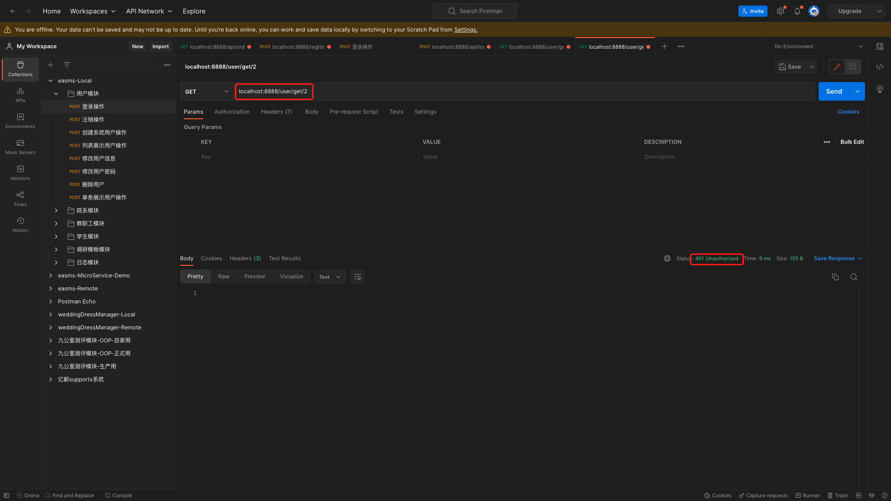
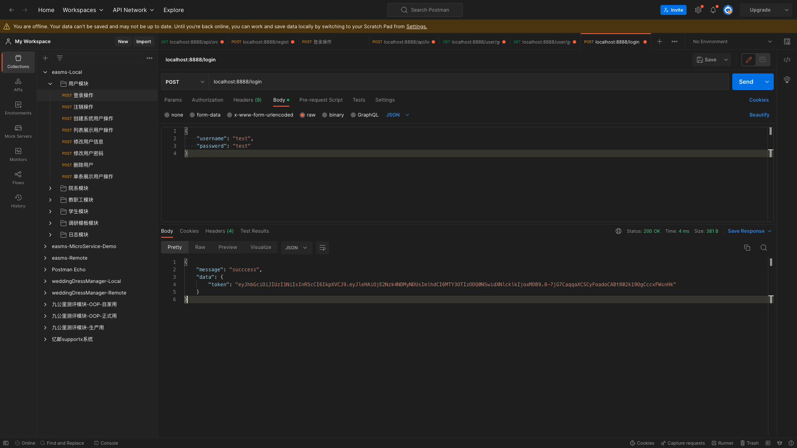
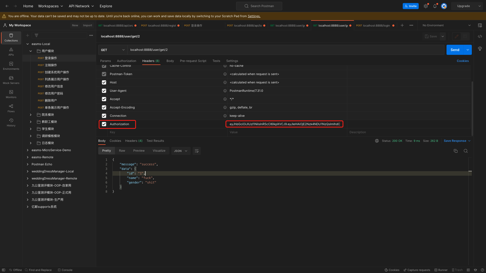

# 集成JWT

go-zero中提供了JWT的功能.本章节主要在userapi层演示该功能.

## PART1. 在配置文件中添加JWT相关配置

`userapi/etc/userapi-api.yaml`:

```yaml
Name: userapi-api
Host: 0.0.0.0
Port: 8888
UserRpc:
  # 指定注册中心的类型
  Etcd:
    # 指定注册中心的IP地址和端口
    Hosts:
      - 127.0.0.1:2379
    # 指定要查询的key 此处的key是user rpc服务中
    # 配置文件中 Key字段的值
    Key: user.rpc
Auth:
  # JWT所需密钥
  Secret: "NEWnew123!@#"
  # 过期时间 单位:秒 此处设定为1周
  ExpireIn: 604800
```

## PART2. 在配置结构体中添加对应字段

`userapi/internal/config/config.go`:

```go
package config

import (
	"github.com/zeromicro/go-zero/rest"
	"github.com/zeromicro/go-zero/zrpc"
)

type Config struct {
	rest.RestConf
	UserRpc zrpc.RpcClientConf
	Auth    Auth
}

type Auth struct {
	Secret string
	ExpireIn int64
}
```

## PART3. 发放token

此处模拟一个登录功能,以便能够发放token

### 3.1 定义请求和响应结构体

`userapi/internal/types/types.go`:

```go
// Code generated by goctl. DO NOT EDIT.
package types

type Request struct {
	Name string `json:"name"`
	Gender string `json:"gender"`
}

type Response struct {
	Message string `json:"message"`
	Data any `json:"data"`
}

type GetUserRequest struct {
	Id string `path:"id"`
}

type GetUserResponse struct {
	Message string `json:"message"`
	Data any `json:"data"`
}

type LoginRequest struct {
	Username string `json:"username"`
	Password string `json:"password"`
}

type LoginResponse struct {
	Message string `json:"message"`
	Data any `json:"data"`
}
```

### 3.2 实现业务逻辑

#### 3.2.1 实现发放token

`userapi/internal/logic/userapilogic.go`:

```go
package logic

import (
	"context"
	"github.com/golang-jwt/jwt/v4"
	"rpc-common/user/types/user"
	"time"

	"userapi/internal/svc"
	"userapi/internal/types"

	"github.com/zeromicro/go-zero/core/logx"
)

type UserapiLogic struct {
	logx.Logger
	ctx    context.Context
	svcCtx *svc.ServiceContext
}

func NewUserLogic(ctx context.Context, svcCtx *svc.ServiceContext) *UserapiLogic {
	return &UserapiLogic{
		Logger: logx.WithContext(ctx),
		ctx:    ctx,
		svcCtx: svcCtx,
	}
}

func (l *UserapiLogic) Userapi(req *types.Request) (resp *types.Response, err error) {
	// todo: add your logic here and delete this line

	return
}

func (l *UserapiLogic) Register(req *types.Request) (resp *types.Response, err error) {
	// todo: add your logic here and delete this line
	// 一般做超时上下文
	ctx, cancelFunc := context.WithTimeout(context.Background(), 5*time.Second)
	defer cancelFunc()
	saveReq := &user.UserRequest{
		Name:   req.Name,
		Gender: req.Gender,
	}
	saveResp, err := l.svcCtx.UserRpc.SaveUser(ctx, saveReq)
	if err != nil {
		return nil, err
	}
	resp = &types.Response{
		Message: "success",
		Data:    saveResp,
	}
	return resp, nil
}

func (l *UserapiLogic) GetUser(t *types.GetUserRequest) (resp *types.GetUserResponse, err error) {
	ctx, cancelFunc := context.WithTimeout(context.Background(), 5*time.Second)
	defer cancelFunc()
	userResponse, err := l.svcCtx.UserRpc.GetUser(ctx, &user.IdRequest{Id: t.Id})
	if err != nil {
		return nil, err
	}
	resp = &types.GetUserResponse{
		Message: "success",
		Data:    userResponse,
	}
	return resp, nil
}

func (l *UserapiLogic) Login(t *types.LoginRequest) (resp *types.LoginResponse, err error) {
	userId := 1
	secret := l.svcCtx.Config.Auth.Secret
	expireIn := l.svcCtx.Config.Auth.ExpireIn
	signAt := time.Now().Unix()
	token, err := genToken(secret, signAt, expireIn, int64(userId))
	if err != nil {
		return nil, err
	}
	resp = &types.LoginResponse{
		Message: "succcess",
		Data: map[string]string{
			"token": token,
		},
	}
	return resp, nil
}

// genToken 生成token
// secret:密钥
// signAt: 签发时间
// expireIn: token生命周期
// userId: 用户ID
func genToken(secret string, signAt, expireIn, userId int64) (string, error) {
	claims := make(jwt.MapClaims)
	// Tips: 以下2个key的值是jwt.MapClaims预制的 必须这么写key值
	claims["exp"] = signAt + expireIn
	claims["iat"] = signAt
	// Tips: 这个key的值可以自定义的 后续验证token通过后 该K-V将会被存入上下文中
	claims["userId"] = userId
	token := jwt.New(jwt.SigningMethodHS256)
	token.Claims = claims
	return token.SignedString([]byte(secret))
}
```

#### 3.2.2 实现通过JWT认证后从上下文中读取token中的有效信息

`userapi/internal/logic/userapilogic.go`:

```go
package logic

import (
	"context"
	"github.com/golang-jwt/jwt/v4"
	"rpc-common/user/types/user"
	"strconv"
	"time"

	"userapi/internal/svc"
	"userapi/internal/types"

	"github.com/zeromicro/go-zero/core/logx"
)

type UserapiLogic struct {
	logx.Logger
	ctx    context.Context
	svcCtx *svc.ServiceContext
}

func NewUserLogic(ctx context.Context, svcCtx *svc.ServiceContext) *UserapiLogic {
	return &UserapiLogic{
		Logger: logx.WithContext(ctx),
		ctx:    ctx,
		svcCtx: svcCtx,
	}
}

func (l *UserapiLogic) Userapi(req *types.Request) (resp *types.Response, err error) {
	// todo: add your logic here and delete this line

	return
}

func (l *UserapiLogic) Register(req *types.Request) (resp *types.Response, err error) {
	// todo: add your logic here and delete this line
	// 一般做超时上下文
	ctx, cancelFunc := context.WithTimeout(context.Background(), 5*time.Second)
	defer cancelFunc()
	saveReq := &user.UserRequest{
		Name:   req.Name,
		Gender: req.Gender,
	}
	saveResp, err := l.svcCtx.UserRpc.SaveUser(ctx, saveReq)
	if err != nil {
		return nil, err
	}
	resp = &types.Response{
		Message: "success",
		Data:    saveResp,
	}
	return resp, nil
}

func (l *UserapiLogic) GetUser(t *types.GetUserRequest) (resp *types.GetUserResponse, err error) {
	// 认证通过后 从token中获取userId
	userId := l.ctx.Value("userId")
	fmt.Printf("获取到的token内容为: %s \n", userId)
	userIdStr := string(userId.(json.Number))
	ctx, cancelFunc := context.WithTimeout(context.Background(), 5*time.Second)
	defer cancelFunc()
	userResponse, err := l.svcCtx.UserRpc.GetUser(ctx, &user.IdRequest{Id: userIdStr})
	if err != nil {
		return nil, err
	}
	resp = &types.GetUserResponse{
		Message: "success",
		Data:    userResponse,
	}
	return resp, nil
}

func (l *UserapiLogic) Login(t *types.LoginRequest) (resp *types.LoginResponse, err error) {
	userId := 1
	secret := l.svcCtx.Config.Auth.Secret
	expireIn := l.svcCtx.Config.Auth.ExpireIn
	signAt := time.Now().Unix()
	token, err := genToken(secret, signAt, expireIn, int64(userId))
	if err != nil {
		return nil, err
	}
	resp = &types.LoginResponse{
		Message: "succcess",
		Data: map[string]string{
			"token": token,
		},
	}
	return resp, nil
}

// genToken 生成token
// secret:密钥
// signAt: 签发时间
// expireIn: token生命周期
// userId: 用户ID
func genToken(secret string, signAt, expireIn, userId int64) (string, error) {
	claims := make(jwt.MapClaims)
	// Tips: 以下2个key的值是jwt.MapClaims预制的 必须这么写key值
	claims["exp"] = signAt + expireIn
	claims["iat"] = signAt
	// Tips: 这个key的值可以自定义的 后续验证token通过后 该K-V将会被存入上下文中
	claims["userId"] = userId
	token := jwt.New(jwt.SigningMethodHS256)
	token.Claims = claims
	return token.SignedString([]byte(secret))
}
```

### 3.3 handler层调用logic

`userapi/internal/handler/register.go`:

```go
package handler

import (
	"github.com/zeromicro/go-zero/rest/httpx"
	"net/http"
	"userapi/internal/logic"
	"userapi/internal/svc"
	"userapi/internal/types"
)

type UserHandler struct {
	SvcCtx *svc.ServiceContext
}

func (h *UserHandler) Register(w http.ResponseWriter, r *http.Request) {
	var req types.Request
	if err := httpx.ParseJsonBody(r, &req); err != nil {
		httpx.ErrorCtx(r.Context(), w, err)
		return
	}

	l := logic.NewUserLogic(r.Context(), h.SvcCtx)
	resp, err := l.Register(&req)
	if err != nil {
		httpx.ErrorCtx(r.Context(), w, err)
	} else {
		httpx.OkJsonCtx(r.Context(), w, resp)
	}
}

func (h *UserHandler) GetUser(w http.ResponseWriter, r *http.Request) {
	var req types.GetUserRequest
	if err := httpx.ParsePath(r, &req); err != nil {
		httpx.ErrorCtx(r.Context(), w, err)
		return
	}

	l := logic.NewUserLogic(r.Context(), h.SvcCtx)
	resp, err := l.GetUser(&req)
	if err != nil {
		httpx.ErrorCtx(r.Context(), w, err)
	} else {
		httpx.OkJsonCtx(r.Context(), w, resp)
	}
}

func (h *UserHandler) Login(w http.ResponseWriter, r *http.Request) {
	var req types.LoginRequest
	if err := httpx.ParseJsonBody(r, &req); err != nil {
		httpx.ErrorCtx(r.Context(), w, err)
		return
	}

	l := logic.NewUserLogic(r.Context(), h.SvcCtx)
	resp, err := l.Login(&req)
	if err != nil {
		httpx.ErrorCtx(r.Context(), w, err)
	} else {
		httpx.OkJsonCtx(r.Context(), w, resp)
	}
}

func NewUserHandler(svcCtx *svc.ServiceContext) *UserHandler {
	return &UserHandler{SvcCtx: svcCtx}
}
```

### 3.4 添加路由

此处我们之前实现了2个路由:`/register`和`/user/get/:id`.我们假定现在实现的发放token的路由为`/login`.那么此时,`/register`和`/login`是不需要JWT认证的,而`/user/get/:id`是需要JWT认证的.

#### 3.4.1 修改`userapi.api`

`userapi/userapi.api`:

```
type Request {
	Name string `path:"name,options=you|me"`
}

type Response {
	Message string `json:"message"`
}

@server(
	// 指定认证方式 写在指定认证方式之后的路由 都需要认证
	jwt: Auth
)

service userapi-api {
	@handler UserapiHandler
	get /from/:name(Request) returns (Response)
}
```

#### 3.4.2 生成代码

```
(base) yanglei@192 userapi % pwd
/Users/yanglei/Desktop/go-zero-study/goZeroStudy/07-集成JWT/mall/userapi
(base) yanglei@192 userapi % goctl api go -api userapi.api -dir ./gen
Done.
```

#### 3.4.3 看生成的路由

`userapi/gen/internal/handler/routes.go`:

```go
// Code generated by goctl. DO NOT EDIT.
package handler

import (
	"net/http"

	"userapi/gen/internal/svc"

	"github.com/zeromicro/go-zero/rest"
)

func RegisterHandlers(server *rest.Server, serverCtx *svc.ServiceContext) {
	server.AddRoutes(
		[]rest.Route{
			{
				Method:  http.MethodGet,
				Path:    "/from/:name",
				Handler: UserapiHandler(serverCtx),
			},
		},
		rest.WithJwt(serverCtx.Config.Auth.AccessSecret),
	)
}
```

重点是看`rest.WithJwt(serverCtx.Config.Auth.AccessSecret)`,也就知道了如何让指定的路由需要JWT认证才能访问.当然,看完这个就可以把整个`userapi/gen`目录删掉了.

#### 3.4.4 添加登录路由并设置JWT认证路由

`userapi/internal/handler/routes.go`:

```go
// Code generated by goctl. DO NOT EDIT.
package handler

import (
	"net/http"

	"userapi/internal/svc"

	"github.com/zeromicro/go-zero/rest"
)

func RegisterHandlers(server *rest.Server, serverCtx *svc.ServiceContext) {
	handler := NewUserHandler(serverCtx)
	// 不需要JWT认证的路由
	server.AddRoutes(
		[]rest.Route{
			{
				Method:  http.MethodPost,
				Path:    "/register",
				Handler: handler.Register,
			},
			{
				Method:  http.MethodPost,
				Path:    "/login",
				Handler: handler.Login,
			},
		},
	)

	// 需要JWT认证的路由
	server.AddRoutes(
		[]rest.Route{
			{
				Method:  http.MethodGet,
				Path:    "/user/get/:id",
				Handler: handler.GetUser,
			},
		},
		rest.WithJwt(serverCtx.Config.Auth.Secret),
	)
}
```

## PART4. 测试



可以看到,因为token的问题,HTTP状态码为401.



可以看到,此处获取了token.



可以看到,带着token访问时,读取到的用户信息是和token相关的.