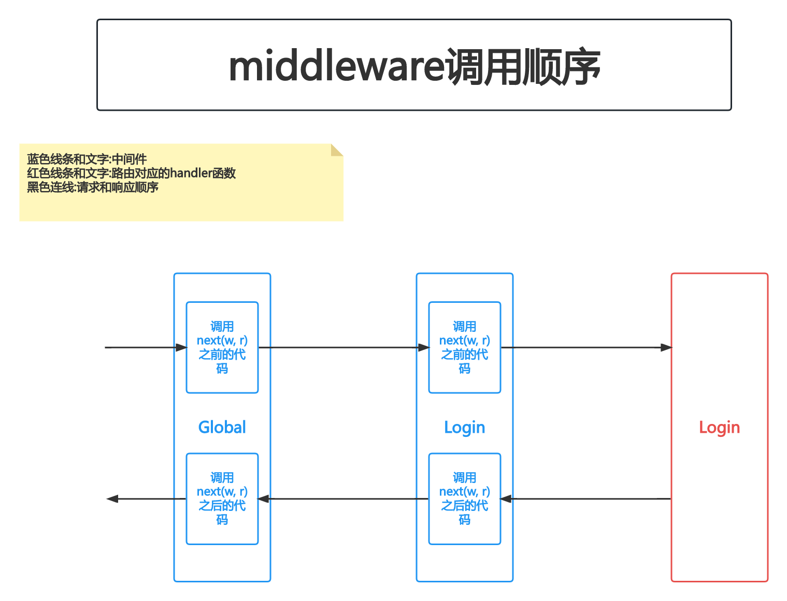

# 中间件

## PART1. 路由中间件

路由中间件是指给指定的某些路由添加一些中间件.

### 1.1 生成一个中间件,看它的代码结构

#### 1.1.1 生成代码

`userapi/userapi.api`:

```
type Request {
	Name string `path:"name,options=you|me"`
}

type Response {
	Message string `json:"message"`
}

@server(
	// 指定认证方式 写在指定认证方式之后的路由 都需要认证
	jwt: Auth
	// 声明中间件
	middleware: Example
)

service userapi-api {
	@handler UserapiHandler
	get /from/:name(Request) returns (Response)
}
```

生成代码:

```
(base) yanglei@192 userapi % pwd
/Users/yanglei/Desktop/go-zero-study/goZeroStudy/08-中间件/mall/userapi
(base) yanglei@192 userapi % goctl api go -api userapi.api -dir ./gen
Done.
```

#### 1.1.2 观察结构

##### 1.1.2.1 路由层

`userapi/gen/internal/handler/routes.go`:

```go
// Code generated by goctl. DO NOT EDIT.
package handler

import (
	"net/http"

	"userapi/gen/internal/svc"

	"github.com/zeromicro/go-zero/rest"
)

func RegisterHandlers(server *rest.Server, serverCtx *svc.ServiceContext) {
	server.AddRoutes(
		rest.WithMiddlewares(
			[]rest.Middleware{serverCtx.Example},
			[]rest.Route{
				{
					Method:  http.MethodGet,
					Path:    "/from/:name",
					Handler: UserapiHandler(serverCtx),
				},
			}...,
		),
		rest.WithJwt(serverCtx.Config.Auth.AccessSecret),
	)
}
```

可以看到,在添加路由时,使用`rest.WithMiddlewares()`函数即可指定中间件.其第一个参数位中间件切片,第二个参数为路由切片中的每一个元素(注意实参`[]rest.Route`最后的`...`).

##### 1.1.2.2 资源池层初始化中间件

上边的代码中有一行`serverCtx.Example`,很明显是在资源池层初始化了中间件

`userapi/gen/internal/svc/servicecontext.go`:

```go
package svc

import (
	"github.com/zeromicro/go-zero/rest"
	"userapi/gen/internal/config"
	"userapi/gen/internal/middleware"
)

type ServiceContext struct {
	Config  config.Config
	Example rest.Middleware
}

func NewServiceContext(c config.Config) *ServiceContext {
	return &ServiceContext{
		Config:  c,
		Example: middleware.NewExampleMiddleware().Handle,
	}
}
```

##### 1.1.2.3 中间件的定义

在上边的代码中有一行`middleware.NewExampleMiddleware().Handle`,猜测它就是中间件的定义了.

`userapi/gen/internal/middleware/examplemiddleware.go`:

```go
package middleware

import "net/http"

type ExampleMiddleware struct {
}

func NewExampleMiddleware() *ExampleMiddleware {
	return &ExampleMiddleware{}
}

func (m *ExampleMiddleware) Handle(next http.HandlerFunc) http.HandlerFunc {
	return func(w http.ResponseWriter, r *http.Request) {
		// TODO generate middleware implement function, delete after code implementation

		// Passthrough to next handler if need
		next(w, r)
	}
}
```

### 1.2 实现一个中间件

#### 1.2.1 修改路由层

`userapi/internal/handler/routes.go`:

```go
// Code generated by goctl. DO NOT EDIT.
package handler

import (
	"net/http"

	"userapi/internal/svc"

	"github.com/zeromicro/go-zero/rest"
)

func RegisterHandlers(server *rest.Server, serverCtx *svc.ServiceContext) {
	handler := NewUserHandler(serverCtx)
	// 不需要JWT认证的路由
	server.AddRoutes(
		rest.WithMiddlewares(
			[]rest.Middleware{},
			[]rest.Route{
			{
				Method:  http.MethodPost,
				Path:    "/register",
				Handler: handler.Register,
			},
			{
				Method:  http.MethodPost,
				Path:    "/login",
				Handler: handler.Login,
			},
		}...,),
	)

	// 需要JWT认证的路由
	server.AddRoutes(
		[]rest.Route{
			{
				Method:  http.MethodGet,
				Path:    "/user/get/:id",
				Handler: handler.GetUser,
			},
		},
		rest.WithJwt(serverCtx.Config.Auth.Secret),
	)
}
```

这种中间件叫做**路由中间件**.

#### 1.2.2 实现中间件

实际上go-zero对中间件的定义如下:

```go
type Middleware func(next http.HandlerFunc) http.HandlerFunc
```

也就是说我们自己实现中间件,只需实现这个函数就可以了.

创建目录`userapi/internal/middlewares`,在该目录下创建文件`user.go`:

```go
package middlewares

import (
	"fmt"
	"net/http"
)

type UserMiddleware struct {
}

func NewUserMiddleware() *UserMiddleware {
	return &UserMiddleware{}
}

func (u *UserMiddleware) LoginAndRegister(next http.HandlerFunc) http.HandlerFunc {
	return func(w http.ResponseWriter, r *http.Request) {
		fmt.Printf("调用login和register之前执行...\n")
		next(w, r)
		fmt.Printf("调用login和register之后执行...\n")
	}
}
```

此处我们只是演示,所以仅仅在中间件中打印一些内容,表明哪部分是调接口之前执行的逻辑,哪部分是调接口之后执行的逻辑.

#### 1.2.3 在接口中添加一些打印,以印证执行顺序

`userapi/internal/logic/userlogic.go`:

```go
package logic

import (
	"context"
	"encoding/json"
	"fmt"
	"github.com/golang-jwt/jwt/v4"
	"rpc-common/user/types/user"
	"time"

	"userapi/internal/svc"
	"userapi/internal/types"

	"github.com/zeromicro/go-zero/core/logx"
)

type UserapiLogic struct {
	logx.Logger
	ctx    context.Context
	svcCtx *svc.ServiceContext
}

func NewUserLogic(ctx context.Context, svcCtx *svc.ServiceContext) *UserapiLogic {
	return &UserapiLogic{
		Logger: logx.WithContext(ctx),
		ctx:    ctx,
		svcCtx: svcCtx,
	}
}

func (l *UserapiLogic) Userapi(req *types.Request) (resp *types.Response, err error) {
	// todo: add your logic here and delete this line

	return
}

func (l *UserapiLogic) Register(req *types.Request) (resp *types.Response, err error) {
	// todo: add your logic here and delete this line
	// 一般做超时上下文
	ctx, cancelFunc := context.WithTimeout(context.Background(), 5*time.Second)
	defer cancelFunc()
	saveReq := &user.UserRequest{
		Name:   req.Name,
		Gender: req.Gender,
	}
	saveResp, err := l.svcCtx.UserRpc.SaveUser(ctx, saveReq)
	if err != nil {
		return nil, err
	}
	resp = &types.Response{
		Message: "success",
		Data:    saveResp,
	}
	return resp, nil
}

func (l *UserapiLogic) GetUser(t *types.GetUserRequest) (resp *types.GetUserResponse, err error) {
	// 认证通过后 从token中获取userId
	userId := l.ctx.Value("userId")
	fmt.Printf("获取到的token内容为: %s \n", userId)
	userIdStr := string(userId.(json.Number))
	ctx, cancelFunc := context.WithTimeout(context.Background(), 5*time.Second)
	defer cancelFunc()
	userResponse, err := l.svcCtx.UserRpc.GetUser(ctx, &user.IdRequest{Id: userIdStr})
	if err != nil {
		return nil, err
	}
	resp = &types.GetUserResponse{
		Message: "success",
		Data:    userResponse,
	}
	return resp, nil
}

func (l *UserapiLogic) Login(t *types.LoginRequest) (resp *types.LoginResponse, err error) {
	fmt.Printf("正在执行Login方法\n")
	userId := 1
	secret := l.svcCtx.Config.Auth.Secret
	expireIn := l.svcCtx.Config.Auth.ExpireIn
	signAt := time.Now().Unix()
	token, err := genToken(secret, signAt, expireIn, int64(userId))
	if err != nil {
		return nil, err
	}
	resp = &types.LoginResponse{
		Message: "succcess",
		Data: map[string]string{
			"token": token,
		},
	}
	return resp, nil
}

// genToken 生成token
// secret:密钥
// signAt: 签发时间
// expireIn: token生命周期
// userId: 用户ID
func genToken(secret string, signAt, expireIn, userId int64) (string, error) {
	claims := make(jwt.MapClaims)
	// Tips: 以下2个key的值是jwt.MapClaims预制的 必须这么写key值
	claims["exp"] = signAt + expireIn
	claims["iat"] = signAt
	// Tips: 这个key的值可以自定义的 后续验证token通过后 该K-V将会被存入上下文中
	claims["userId"] = userId
	token := jwt.New(jwt.SigningMethodHS256)
	token.Claims = claims
	return token.SignedString([]byte(secret))
}
```

注意`UserapiLogic.Login()`方法中,添加了一行打印.

#### 1.2.4 添加中间件到资源池

`userapi/internal/svc/servicecontext.go`:

```go
package svc

import (
	"github.com/zeromicro/go-zero/zrpc"
	"rpc-common/user/userclient"
	"userapi/internal/config"
	"userapi/internal/middlewares"
)

type ServiceContext struct {
	Config         config.Config
	UserRpc        userclient.User
	UserMiddleware *middlewares.UserMiddleware
}

func NewServiceContext(c config.Config) *ServiceContext {
	return &ServiceContext{
		Config:         c,
		UserRpc:        userclient.NewUser(zrpc.MustNewClient(c.UserRpc)),
		UserMiddleware: middlewares.NewUserMiddleware(),
	}
}
```

#### 1.2.5 路由层中添加中间件

`userapi/internal/handler/routes.go`:

```go
// Code generated by goctl. DO NOT EDIT.
package handler

import (
	"net/http"

	"userapi/internal/svc"

	"github.com/zeromicro/go-zero/rest"
)

func RegisterHandlers(server *rest.Server, serverCtx *svc.ServiceContext) {
	handler := NewUserHandler(serverCtx)
	// 不需要JWT认证的路由
	server.AddRoutes(
		rest.WithMiddlewares(
			[]rest.Middleware{serverCtx.UserMiddleware.LoginAndRegister},
			[]rest.Route{
			{
				Method:  http.MethodPost,
				Path:    "/register",
				Handler: handler.Register,
			},
			{
				Method:  http.MethodPost,
				Path:    "/login",
				Handler: handler.Login,
			},
		}...,),
	)

	// 需要JWT认证的路由
	server.AddRoutes(
		[]rest.Route{
			{
				Method:  http.MethodGet,
				Path:    "/user/get/:id",
				Handler: handler.GetUser,
			},
		},
		rest.WithJwt(serverCtx.Config.Auth.Secret),
	)
}
```

### 1.3 测试

请求`login`路由时的日志内容:

```
(base) yanglei@192 userapi % go run userapi.go
Starting server at 0.0.0.0:8888...
调用login和register之前执行...
正在执行Login方法
调用login和register之后执行...
{"@timestamp":"2023-03-20T10:34:41.647+08:00","caller":"handler/loghandler.go:160","content":"[HTTP] 200 - POST /login - [::1]:51099 - PostmanRuntime/7.31.0","duration":"0.2ms","level":"info","span":"10a1c399213e658c","trace":"53a7fa98104a47de8cb41f5e03a80660"}
```

从效果中也可以看出来,实际上定义中间件时的那句`next(w, r)`,就是执行路由对应的方法.

## PART2. 全局中间件

全局中间件自然就是所有路由都要执行的中间件.

### 2.1 定义全局中间件函数

`userapi/internal/middlewares/user.go`:

```go
package middlewares

import (
	"fmt"
	"net/http"
)

type UserMiddleware struct {
}

func NewUserMiddleware() *UserMiddleware {
	return &UserMiddleware{}
}

func (u *UserMiddleware) LoginAndRegister(next http.HandlerFunc) http.HandlerFunc {
	return func(w http.ResponseWriter, r *http.Request) {
		fmt.Printf("调用login和register之前执行...\n")
		next(w, r)
		fmt.Printf("调用login和register之后执行...\n")
	}
}

func (u *UserMiddleware) Global(next http.HandlerFunc) http.HandlerFunc {
	return func(w http.ResponseWriter, r *http.Request) {
		fmt.Printf("调用所有函数之前执行...\n")
		next(w, r)
		fmt.Printf("调用所有函数之后执行...\n")
	}
}
```

### 2.2 使用全局中间件

`userapi/internal/handler/routes.go`:

```go
// Code generated by goctl. DO NOT EDIT.
package handler

import (
	"net/http"

	"userapi/internal/svc"

	"github.com/zeromicro/go-zero/rest"
)

func RegisterHandlers(server *rest.Server, serverCtx *svc.ServiceContext) {
	handler := NewUserHandler(serverCtx)
	// 全局中间件
	server.Use(serverCtx.UserMiddleware.Global)
	// 不需要JWT认证的路由
	server.AddRoutes(
		rest.WithMiddlewares(
			// 路由中间件
			[]rest.Middleware{serverCtx.UserMiddleware.LoginAndRegister},
			[]rest.Route{
			{
				Method:  http.MethodPost,
				Path:    "/register",
				Handler: handler.Register,
			},
			{
				Method:  http.MethodPost,
				Path:    "/login",
				Handler: handler.Login,
			},
		}...,),
	)

	// 需要JWT认证的路由
	server.AddRoutes(
		[]rest.Route{
			{
				Method:  http.MethodGet,
				Path:    "/user/get/:id",
				Handler: handler.GetUser,
			},
		},
		rest.WithJwt(serverCtx.Config.Auth.Secret),
	)
}
```

### 2.2 测试

请求`user/get/:id`路由时的日志内容:

```
(base) yanglei@192 userapi % go run userapi.go
Starting server at 0.0.0.0:8888...
调用所有函数之前执行...
获取到的token内容为: 1 
{"@timestamp":"2023-03-20T10:47:44.672+08:00","caller":"p2c/p2c.go:181","content":"p2c - conn: 192.168.0.101:8080, load: 1356, reqs: 1","level":"stat"}
调用所有函数之后执行...
{"@timestamp":"2023-03-20T10:47:44.672+08:00","caller":"handler/loghandler.go:160","content":"[HTTP] 200 - GET /user/get/2 - [::1]:51809 - PostmanRuntime/7.31.0","duration":"2.2ms","level":"info","span":"f2136b7bd99988e1","trace":"4fdbc72a5e93cc1a29c5b6e428e34364"}
```

请求`login`路由时的日志内容:

```
调用所有函数之前执行...
调用login和register之前执行...
正在执行Login方法
调用login和register之后执行...
调用所有函数之后执行...
{"@timestamp":"2023-03-20T10:50:25.266+08:00","caller":"handler/loghandler.go:160","content":"[HTTP] 200 - POST /login - [::1]:51971 - PostmanRuntime/7.31.0","duration":"0.3ms","level":"info","span":"3d562fae1fbdf089","trace":"8e2e9b7c56eb788172618c917e495bb9"}
```



注意这个顺序和代码编写的顺序无关.在请求到达handler函数之前,全局中间件先于路由中间件;在响应离开handler函数之后,路由中间件先于全局中间件.