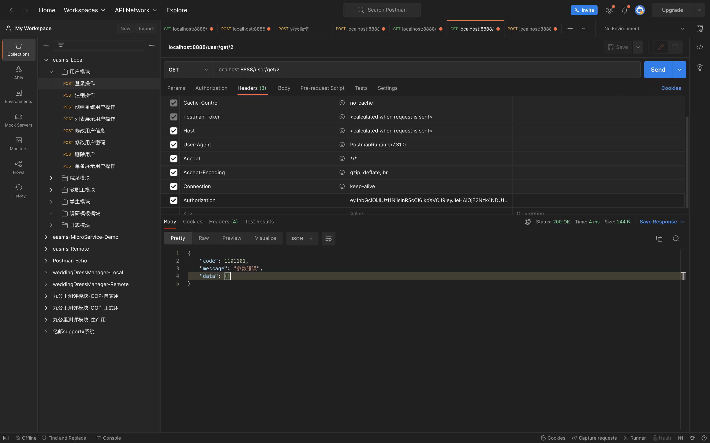

# 自定义错误

在本章节之前,返回的错误都是直接返回的,实际上这种方式并不可用.至少应该和正确响应一样,同样返回一个JSON.

## PART1. 定义错误

创建目录`userapi/internal/bizError`,在该目录下创建文件`error.go`:

```go
package bizError

// ParamError 业务逻辑错误对象
// 错误码:1101101 其中110是前缀,表示出现错误的微服务是userapi
// 1101是有效载荷,表示具体错误
var ParamError = NewBizError(1101101, "参数错误", make(map[string]interface{})

type BizError struct {
	Code    int                    `json:"code"`
	Message string                 `json:"message"`
	Data    map[string]interface{} `json:"data"`
}

func NewBizError(code int, msg string, data map[string]interface{}) *BizError {
	return &BizError{
		Code:    code,
		Message: msg,
		// 默认业务错误的JSON中不会返回数据
		Data: data,
	}
}

func (b *BizError) Error() string {
	return b.Message
}
```

可以看到,我们自定义的业务逻辑错误`BizError`是内置接口`error`的实现.变量`ParamError`即指代了具体的一个错误场景.

## PART2. logic层使用自定义错误

此处我们以`UserapiLogic.GetUser()`方法为例,假设从context中取出的`userId`值为1,则报一个参数错误.

`userapi/internal/logic/userlogic.go`:

```go
package logic

import (
	"context"
	"encoding/json"
	"fmt"
	"github.com/golang-jwt/jwt/v4"
	"rpc-common/user/types/user"
	"time"
	"userapi/internal/bizError"

	"userapi/internal/svc"
	"userapi/internal/types"

	"github.com/zeromicro/go-zero/core/logx"
)

type UserapiLogic struct {
	logx.Logger
	ctx    context.Context
	svcCtx *svc.ServiceContext
}

func NewUserLogic(ctx context.Context, svcCtx *svc.ServiceContext) *UserapiLogic {
	return &UserapiLogic{
		Logger: logx.WithContext(ctx),
		ctx:    ctx,
		svcCtx: svcCtx,
	}
}

func (l *UserapiLogic) Userapi(req *types.Request) (resp *types.Response, err error) {
	// todo: add your logic here and delete this line

	return
}

func (l *UserapiLogic) Register(req *types.Request) (resp *types.Response, err error) {
	// todo: add your logic here and delete this line
	// 一般做超时上下文
	ctx, cancelFunc := context.WithTimeout(context.Background(), 5*time.Second)
	defer cancelFunc()
	saveReq := &user.UserRequest{
		Name:   req.Name,
		Gender: req.Gender,
	}
	saveResp, err := l.svcCtx.UserRpc.SaveUser(ctx, saveReq)
	if err != nil {
		return nil, err
	}
	resp = &types.Response{
		Message: "success",
		Data:    saveResp,
	}
	return resp, nil
}

func (l *UserapiLogic) GetUser(t *types.GetUserRequest) (resp *types.GetUserResponse, err error) {
	// 认证通过后 从token中获取userId
	userId := l.ctx.Value("userId")
	fmt.Printf("获取到的token内容为: %s \n", userId)
	userIdStr := string(userId.(json.Number))
	ctx, cancelFunc := context.WithTimeout(context.Background(), 5*time.Second)
	defer cancelFunc()
	// 此处由于发放token时向上下文中存入的userId就是1 故从上下文中拿到的userId值肯定是1
	// 所以必然触发错误
	if userIdStr == "1" {
		return nil, bizError.ParamError
	}
	userResponse, err := l.svcCtx.UserRpc.GetUser(ctx, &user.IdRequest{Id: userIdStr})
	if err != nil {
		return nil, err
	}
	resp = &types.GetUserResponse{
		Message: "success",
		Data:    userResponse,
	}
	return resp, nil
}

func (l *UserapiLogic) Login(t *types.LoginRequest) (resp *types.LoginResponse, err error) {
	fmt.Printf("正在执行Login方法\n")
	userId := 1
	secret := l.svcCtx.Config.Auth.Secret
	expireIn := l.svcCtx.Config.Auth.ExpireIn
	signAt := time.Now().Unix()
	token, err := genToken(secret, signAt, expireIn, int64(userId))
	if err != nil {
		return nil, err
	}
	resp = &types.LoginResponse{
		Message: "success",
		Data: map[string]string{
			"token": token,
		},
	}
	return resp, nil
}

// genToken 生成token
// secret:密钥
// signAt: 签发时间
// expireIn: token生命周期
// userId: 用户ID
func genToken(secret string, signAt, expireIn, userId int64) (string, error) {
	claims := make(jwt.MapClaims)
	// Tips: 以下2个key的值是jwt.MapClaims预制的 必须这么写key值
	claims["exp"] = signAt + expireIn
	claims["iat"] = signAt
	// Tips: 这个key的值可以自定义的 后续验证token通过后 该K-V将会被存入上下文中
	claims["userId"] = userId
	token := jwt.New(jwt.SigningMethodHS256)
	token.Claims = claims
	return token.SignedString([]byte(secret))
}
```

此处只看`UserapiLogic.GetUser()`方法,由于我们定义错误时,已经将`bizError.BizError`定义成了内置接口`error`的实现,故此处可以直接返回.

## PART3. 定义业务逻辑错误对应的响应结构体

由于`bizError.BizError.Error()`方法只能返回一个string,故无法传递出更多的错误信息.需要定义一个用于最终返回给前端的响应结构体,来表达这个错误.

`userapi/internal/bizError/error.go`:

```go
package bizError

// ParamError 业务逻辑错误对象
// 错误码:1101101 其中110是前缀,表示出现错误的微服务是userapi
// 1101是有效载荷,表示具体错误
var ParamError = NewBizError(1101101, "参数错误", make(map[string]interface{})

type BizError struct {
	Code    int                    `json:"code"`
	Message string                 `json:"message"`
	Data    map[string]interface{} `json:"data"`
}

func NewBizError(code int, msg string, data map[string]interface{}) *BizError {
	return &BizError{
		Code:    code,
		Message: msg,
		// 默认业务错误的JSON中不会返回数据
		Data: data,
	}
}

func (b *BizError) Error() string {
	return b.Message
}

func (b *BizError) GenResp() *BizErrResponse {
	return &BizErrResponse{
		Code:    b.Code,
		Message: b.Message,
		Data:    b.Data,
	}
}

type BizErrResponse struct {
	Code    int                    `json:"code"`
	Message string                 `json:"message"`
	Data    map[string]interface{} `json:"data"`
}
```

## PART4. 使用业务逻辑对应的结构体

此处并不是在handler层判断错误的类型,而是直接在入口函数中,对所有的路由判断错误的类型.因为在handler层判断错误,只能是针对每个具体的路由中可能出现的错误类型进行判断并返回对应的响应结构体;而在入口函数处的判断,是对所有路由做同样的处理.可以认为是抽象层级更高的做法(但我并不是很认同这种代码组织形式).

`userapi/userapi.go`:

```go
package main

import (
	"context"
	"flag"
	"fmt"
	"github.com/zeromicro/go-zero/rest/httpx"
	"net/http"
	"userapi/internal/bizError"

	"userapi/internal/config"
	"userapi/internal/handler"
	"userapi/internal/svc"

	"github.com/zeromicro/go-zero/core/conf"
	"github.com/zeromicro/go-zero/rest"
)

var configFile = flag.String("f", "etc/userapi-api.yaml", "the config file")

func main() {
	flag.Parse()

	var c config.Config
	conf.MustLoad(*configFile, &c)

	server := rest.MustNewServer(c.RestConf)
	defer server.Stop()

	ctx := svc.NewServiceContext(c)
	handler.RegisterHandlers(server, ctx)

	// 入口文件处设置错误处理函数 该函数作用于所有路由
	httpx.SetErrorHandlerCtx(func(ctx context.Context, err error) (httpStatus int, errResp any) {
		switch e := err.(type) {
		case *bizError.BizError:
			errResp = e.GenResp()
			return http.StatusOK, errResp
		default:
			return http.StatusInternalServerError, nil
		}
	})

	httpx.SetErrorHandler(func(err error) (httpStatus int, errResp any) {
		switch e := err.(type) {
		case *bizError.BizError:
			errResp = e.GenResp()
			return http.StatusOK, errResp
		default:
			return http.StatusInternalServerError, nil
		}
	})

	fmt.Printf("Starting server at %s:%d...\n", c.Host, c.Port)
	server.Start()
}
```

此处既调用了`httpx.SetErrorHandlerCtx()`来处理错误,也调用了`httpx.SetErrorHandler()`来处理错误.这是因为入口函数的地方是不确定handler层最终使用的是`httpx.ErrorCtx()`/`httpx.OkJsonCtx()`的方式返回响应;还是使用`httpx.Error()`/`httpx.OKJson()`返回响应的.

## PART5. 测试



## PART6. 修改模板

go-zero生成代码的都是基于模板去生成的,如果生成的代码不符合你的期望,可以自行修改模板代码.

### 6.1 初始化模板

```
(base) xxx@192 userapi % goctl template init
Templates are generated in /Users/xxx/.goctl/1.4.4, edit on your risk!
```

模板文件就存放在这个位置上.有需要自行修改即可.
