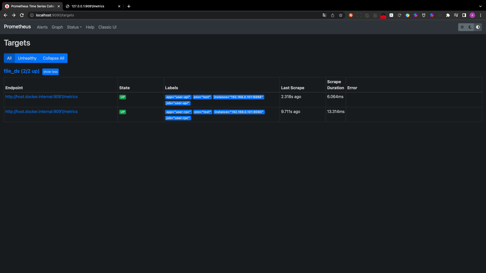

# Prometheus

官方文档:[服务监控](https://go-zero.dev/cn/docs/deployment/service-monitor)

## PART1. 添加Prometheus的metrics配置

此处添加的配置,相当于是go-zero自己实现了一个exporter

### 1.1 给user api服务添加metrics配置

`userapi/etc/userapi-api.yaml`:

```yaml
Name: userapi-api
Host: 0.0.0.0
Port: 8888
UserRpc:
  # 指定注册中心的类型
  Etcd:
    # 指定注册中心的IP地址和端口
    Hosts:
      - 127.0.0.1:2379
    # 指定要查询的key 此处的key是user rpc服务中
    # 配置文件中 Key字段的值
    Key: user.rpc
Auth:
  # JWT所需密钥
  Secret: "newNEW123!@#"
  # 过期时间 单位:秒 此处设定为1周
  ExpireIn: 604800
Prometheus:
  # metrics监听的地址
  Host: 127.0.0.1
  # metrics监听的端口
  Port: 9081
  Path: /metrics
```

### 1.2 给user rpc服务添加metrics配置

`user/etc/user.yaml`:

```yaml
Name: user.rpc
ListenOn: 0.0.0.0:8080
Etcd:
  Hosts:
  - 127.0.0.1:2379
  Key: user.rpc
MySQL:
  DataSource: root:123456@tcp(127.0.0.1:3306)/zero_mall?charset=utf8&parseTime=true&loc=Local
CacheRedis:
  - Host: 127.0.0.1:6379
    Type: node
Prometheus:
  # metrics监听的地址
  Host: 127.0.0.1
  # metrics监听的端口
  Port: 9091
  Path: /metrics
```

## PART2. 部署prometheus

### 2.1 编写配置文件

#### 2.1.1 编写prometheus server配置文件

创建路径`mall/docker-prometheus`,在该路径下创建文件`prometheus.yml`:

```yaml
# my global config
global:
  scrape_interval: 15s # Set the scrape interval to every 15 seconds. Default is every 1 minute.
  evaluation_interval: 15s # Evaluate rules every 15 seconds. The default is every 1 minute.
  # scrape_timeout is set to the global default (10s).

# Alertmanager configuration
alerting:
  alertmanagers:
    - static_configs:
        - targets:
          # - alertmanager:9093

# Load rules once and periodically evaluate them according to the global 'evaluation_interval'.
rule_files:
# - "first_rules.yml"
# - "second_rules.yml"

# A scrape configuration containing exactly one endpoint to scrape:
# Here it's Prometheus itself.
scrape_configs:
  # The job name is added as a label `job=<job_name>` to any timeseries scraped from this config.
  - job_name: 'file_ds'
    file_sd_configs:
      - files:
          - targets.json
```

#### 2.1.2 编写抓取任务配置文件

`mall/docker-prometheus/targets.json`:

```json
[
  {
    "targets": ["host.docker.internal:9081"],
    "labels": {
      "job": "user-api",
      "app": "user-api",
      "env": "test",
      "instance": "192.168.0.101:8888"
    }
  },
  {
    "targets": ["host.docker.internal:9091"],
    "labels": {
      "job": "user-rpc",
      "app": "user-rpc",
      "env": "test",
      "instance": "192.168.0.101:8080"
    }
  }
]
```

注:此处`host.docker.internal`是容器内部访问物理机端口的一种方式.

### 2.2 启动容器

```
(base) yanglei@192 docker-prometheus % docker run -p 9090:9090 -v /Users/yanglei/Desktop/go-zero-study/goZeroStudy/12-Prometheus/mall/docker-prometheus/prometheus.yml:/etc/prometheus/prometheus.yml -v /Users/yanglei/Desktop/go-zero-study/goZeroStudy/12-Prometheus/mall/docker-prometheus/targets.json:/etc/prometheus/targets.json prom/prometheus
```

## PART3. 测试

