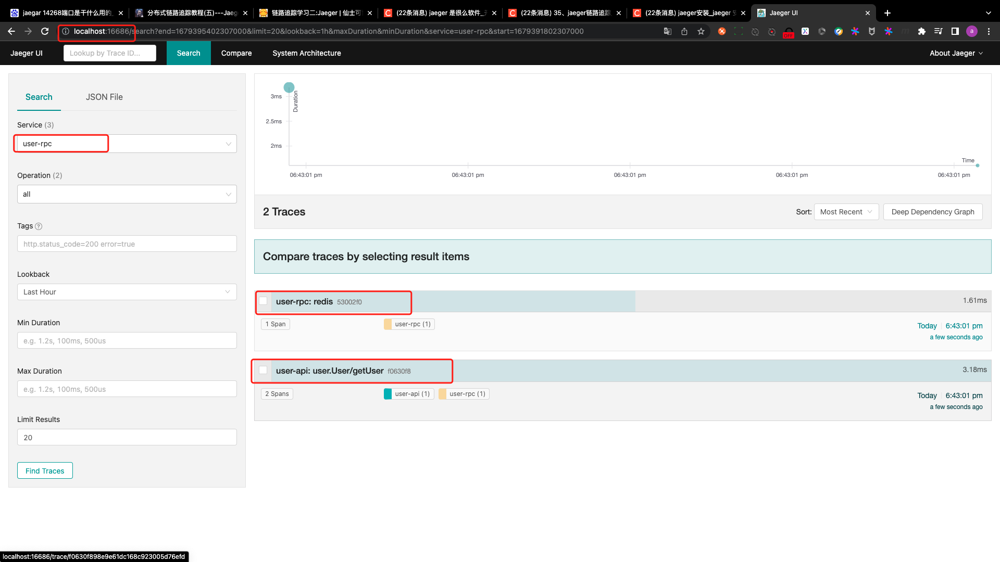

# jaeger

## PART1. 添加jaeger配置

### 1.1 user api添加jaeger配置

`userapi/etc/userapi-api.yaml`:

```yaml
Name: userapi-api
Host: 0.0.0.0
Port: 8888
UserRpc:
  # 指定注册中心的类型
  Etcd:
    # 指定注册中心的IP地址和端口
    Hosts:
      - 127.0.0.1:2379
    # 指定要查询的key 此处的key是user rpc服务中
    # 配置文件中 Key字段的值
    Key: user.rpc
Auth:
  # JWT所需密钥
  Secret: "newNEW123!@#"
  # 过期时间 单位:秒 此处设定为1周
  ExpireIn: 604800
Prometheus:
  # metrics监听的地址
  Host: 127.0.0.1
  # metrics监听的端口
  Port: 9081
  Path: /metrics
Telemetry:
  Name: user-api
  # 14268:jaegar collector的端口 jaegar client可通过该端口
  # 直接将span发送给jaegar collector
  Endpoint: http://localhost:14268/api/traces
  Sampler: 1.0
  Batcher: jaeger
```

### 1.2 user rpc添加jaeger配置

`user/etc/user.yaml`:

```yaml
Name: user.rpc
ListenOn: 0.0.0.0:8080
Etcd:
  Hosts:
  - 127.0.0.1:2379
  Key: user.rpc
MySQL:
  DataSource: root:123456@tcp(127.0.0.1:3306)/zero_mall?charset=utf8&parseTime=true&loc=Local
CacheRedis:
  - Host: 127.0.0.1:6379
    Type: node
Prometheus:
  # metrics监听的地址
  Host: 127.0.0.1
  # metrics监听的端口
  Port: 9091
  Path: /metrics
Telemetry:
  Name: user-rpc
  # 14268:jaegar collector的端口 jaegar client可通过该端口
  # 直接将span发送给jaegar collector
  Endpoint: http://localhost:14268/api/traces
  Sampler: 1.0
  Batcher: jaeger
```

## PART2. 部署jaeger

本例中我们使用ES来存储jaeger的数据.

`mall/docker-compose.yaml`:

```yaml
version: '3'
services:
  jaeger:
    container_name: jaeger
    image: rancher/jaegertracing-all-in-one:1.20.0
    environment:
      - TZ=Asia/Shanghai
      - SPAN_STORAGE_TYPE=elasticsearch
      - ES_SERVER_URLS=http://elasticsearch:9200
      - LOG_LEVEL=debug
    privileged: true
    ports:
      - "6831:6831/udp"
      - "6832:6832/udp"
      - "5778:5778"
      - "16686:16686"
      - "4317:4317"
      - "4318:4318"
      - "14250:14250"
      - "14268:14268"
      - "14269:14269"
      - "9411:9411"
    restart: always
  elasticsearch:
    container_name: elasticsearch
    image: elasticsearch:7.13.1
    environment:
      - TZ=Asia/Shanghai
      - discovery.type=single-node
      - "ES_JAVA_OPTS=-Xms512m -Xmx512m"
    privileged: true
    ports:
      - "9200:9200"
    restart: always
```

## PART3. 测试

