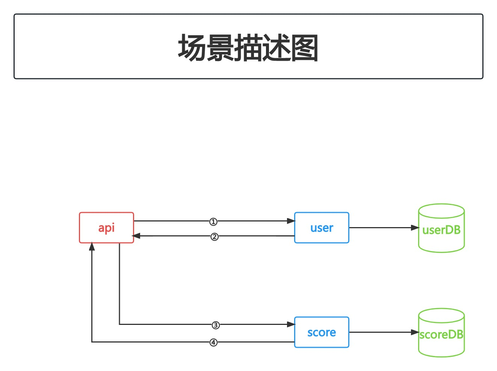
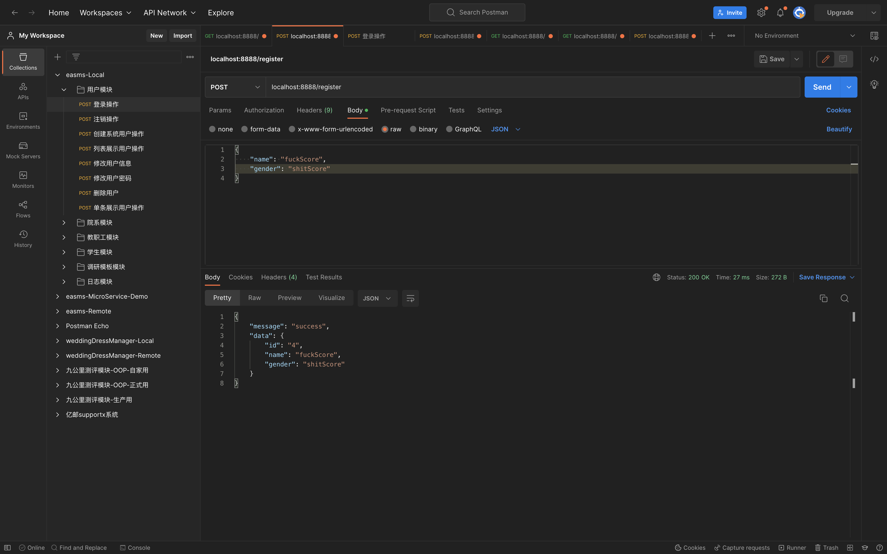

# 分布式事务(1)

## PART1. 概述

在生产环境中,原则上是能不用尽量不用.但很多时候是必须要用的.

[go-zero对分布式事务的支持](https://go-zero.dev/cn/docs/eco/distributed-transaction)

[dtm中文文档](https://www.dtm.pub/)

## PART2. 场景

之前已经实现了一个注册用户的功能.假设用户注册成功后,需要调用另外一个服务,该服务为积分服务.此处的调用会在用户注册成功后向用户账号中添加一些积分.假定此时的需求是:若添加积分失败,则用户注册也不能成功.



## PART3. 部署dtm

此处就不用docker启动了.因为go-zero和dtm对接时,需要加一个配置文件.但dtm官方提供的镜像里,是直接将编译好的二进制放到镜像里去的.所以此处直接从源码启动dtm.

### 3.1 下载源码

```
(base) yanglei@192 go-zero-study % pwd
/Users/yanglei/Desktop/go-zero-study
(base) yanglei@192 go-zero-study % git clone https://github.com/dtm-labs/dtm.git 
Cloning into 'dtm'...
```

### 3.2 修改配置文件

将`dtm/conf.sample.yml`复制一份,复制后的文件为`dtm/conf.yml`,其内容为:

```yaml
MicroService: # gRPC/HTTP based microservice config
  # 指定驱动
  Driver: 'dtm-driver-gozero' # name of the driver to handle register/discover
  # 指定etcd作为注册中心
  Target: 'etcd://localhost:2379/dtmservice' # register dtm server to this url
  # 指定监听的地址和端口
  EndPoint: 'localhost:36790'
```

### 3.3 启动dtm

```
(base) yanglei@192 go-zero-study % cd dtm 
(base) yanglei@192 dtm % pwd
/Users/yanglei/Desktop/go-zero-study/dtm
(base) yanglei@192 dtm % go run main.go -c conf.yml 
```

Tips:如果启动失败,要去改一下源码.

## PART4. 创建DB

```sql
create database if not exists dtm_barrier
CREATE TABLE `user_score` (
  `id` bigint(11) unsigned NOT NULL AUTO_INCREMENT,
  `user_id` bigint(11) NOT NULL DEFAULT '0',
  `score` int(11) NOT NULL DEFAULT '0',
  PRIMARY KEY (`id`)
) ENGINE=InnoDB DEFAULT CHARSET=utf8;
```

此处故意再创建一个数据库,方便后续演示分布式事务的用法.

## PART5. 实现积分服务

### 5.1 创建rpc服务

创建目录`mall/user-score`

#### 5.1.1 编写proto文件

在目录`mall/user-score`下创建文件`user_score.proto`,其内容如下:

```proto
syntax = "proto3";

package score;

// protoc-gen-go 版本大于1.4.0, proto文件需要加上go_package,否则无法生成
option go_package = "./score";

message UserScoreRequest {
  int64 userId = 1;
  int32 score = 2;
}

message UserScoreResponse {
  int64 userId = 1;
  int32 score = 2;
}

service UserScore {
  rpc saveUserScore(UserScoreRequest) returns(UserScoreResponse);
  // saveUserScoreCallback 分布式事务中提交失败之后 回滚时需要执行一个callback
  rpc saveUserScoreCallback(UserScoreRequest) returns(UserScoreResponse);
}
```

注:此处的`saveUserScoreCallback()`是当分布式事务中提交失败之后,回滚时需要执行一个callback.

#### 5.1.2 编写生成代码的脚本

在目录`mall/user-score`下创建文件`gen.sh`,其内容如下:

```shell
goctl rpc protoc user_score.proto --go_out=./types --go-grpc_out=./types --zrpc_out=.
```

#### 5.1.3 生成代码

```
(base) yanglei@192 mall % cd user-score 
(base) yanglei@192 user-score % ./gen.sh 
Done.
```

#### 5.1.4 修改配置文件

`mall/user-score/etc/userscore.yaml`:

```yaml
Name: score.rpc
ListenOn: 0.0.0.0:8096
Etcd:
  Hosts:
    - 127.0.0.1:2379
  Key: score.rpc
MySQL:
  DataSource: root:123456@tcp(127.0.0.1:3306)/dtm_barrier?charset=utf8&parseTime=true&loc=Local
CacheRedis:
  - Host: 127.0.0.1:6379
    Type: node
```

#### 5.1.5 修改配置结构体

##### 5.1.5.1 创建`go.mod`

在`mall/user-score`目录下创建`go.mod`,其内容如下:

```
module user-score

go 1.18
```

##### 5.1.5.2 整理代码

检查生成文件的import,因为goctl生成的代码里关于import部分可能有误.

##### 5.1.5.3 将目录添加至工作空间并拉取依赖

```
(base) yanglei@192 user-score % cd ..
(base) yanglei@192 mall % go work use ./user-score 
(base) yanglei@192 mall % cd -
~/Desktop/go-zero-study/14-分布式事务(1)/mall/user-score
(base) yanglei@192 user-score % go mod tidy
```

##### 5.1.5.4 移动rpc通信相关代码

- 创建目录`mall/rpc-common/user-score`并将`mall/user-score/userscore`目录移动至`mall/rpc-common/user-score`目录下
- 将`mall/user-score/types`目录移动至`mall/rpc-common/user-score`目录下

##### 5.1.5.4 修改配置结构体

`mall/user-score/config/config.go`:

```go
package config

import (
	"github.com/zeromicro/go-zero/core/stores/cache"
	"github.com/zeromicro/go-zero/zrpc"
)

type Config struct {
	zrpc.RpcServerConf
	MySQL      MySQLConfig
	CacheRedis cache.CacheConf
}

type MySQLConfig struct {
	DataSource string
}
```

##### 5.1.5.5 实现连接

创建目录`maill/user-score/database`,在该目录下创建文件`sqlx.go`,其内容如下:

```go
package database

import (
	"github.com/zeromicro/go-zero/core/stores/cache"
	"github.com/zeromicro/go-zero/core/stores/sqlc"
	"github.com/zeromicro/go-zero/core/stores/sqlx"
)

type DBConn struct {
	Conn      sqlx.SqlConn
	ConnCache sqlc.CachedConn
}

func Connect(dataSource string, conf cache.CacheConf) *DBConn {
	sqlConn := sqlx.NewMysql(dataSource)
	d := &DBConn{
		Conn: sqlConn,
	}

	// redis配置不为空 说明需要用缓存 再连接缓存
	if conf != nil {
		cachedConn := sqlc.NewConn(sqlConn, conf)
		d.ConnCache = cachedConn
	}
	return d
}
```

#### 5.1.6 定义模型

创建目录`maill/user-score/internal/model`,在该目录下创建文件`userscore.go`,其内容如下:

```go
package model

type UserScore struct {
	Id     int64 `db:"id"`
	UserId int64 `db:"user_id"`
	Score  int   `db:"score"`
}

func (u *UserScore) TableName() string {
	return "user_score"
}
```

#### 5.1.7 定义repo

创建目录`maill/user-score/internal/repo`,在该目录下创建文件`userscore.go`,其内容如下:

```go
package repo

import (
	"context"
	"user-score/internal/model"
)

type UserScoreRepo interface {
	SaveUserScore(ctx context.Context, user *model.UserScore) error
	FindById(ctx context.Context, id int64) (*model.UserScore, error)
}
```

#### 5.1.8 定义dao层

创建目录`maill/user-score/internal/dao`,在该目录下创建文件`userscore.go`,其内容如下:

```go
package dao

import (
	"context"
	"fmt"
	"github.com/zeromicro/go-zero/core/stores/sqlx"
	"user-score/database"
	"user-score/internal/model"
)

// cacheUserIdPrefix 使用缓存时的key前缀
var cacheUserScoreIdPrefix = "cache:user-score:id:"

type UserScoreDao struct {
	Conn *database.DBConn
}

func NewUserScoreDao(conn *database.DBConn) *UserScoreDao {
	return &UserScoreDao{
		Conn: conn,
	}
}

func (u *UserScoreDao) SaveUserScore(ctx context.Context, user *model.UserScore) error {
	sql := fmt.Sprintf("INSERT INTO %s (`user_id`, `score`) VALUES (?, ?)", user.TableName())
	result, err := u.Conn.Conn.ExecCtx(ctx, sql, user.UserId, user.Score)
	if err != nil {
		return err
	}

	id, err := result.LastInsertId()
	if err != nil {
		return err
	}

	user.Id = id
	return nil
}

func (u *UserScoreDao) FindById(ctx context.Context, id int64) (user *model.UserScore, err error) {
	user = &model.UserScore{}
	sql := fmt.Sprintf("SELECT * FROM %s WHERE `id` = ?", user.TableName())
	// 数据在redis中的key名
	userIdKey := fmt.Sprintf("%s:%d", cacheUserScoreIdPrefix, id)
	// 使用带有cache的连接
	err = u.Conn.ConnCache.QueryRowCtx(ctx, user, userIdKey, func(ctx context.Context, conn sqlx.SqlConn, v any) error {
		return conn.QueryRowCtx(ctx, v, sql, id)
	})

	return user, err
}
```

和之前讲过的一样,`dao.UserScoreDao`就是`repo.UserScoreRepo`的实现.

#### 5.1.9 资源池中添加repo

`user-score/internal/svc/servicecontext.go`:

```go
package svc

import (
	"user-score/database"
	"user-score/internal/config"
	"user-score/internal/dao"
	"user-score/internal/repo"
)

type ServiceContext struct {
	Config        config.Config
	UserScoreRepo repo.UserScoreRepo
}

func NewServiceContext(c config.Config) *ServiceContext {
	return &ServiceContext{
		Config:        c,
		UserScoreRepo: dao.NewUserScoreDao(database.Connect(c.MySQL.DataSource, c.CacheRedis)),
	}
}
```

至此,rpc服务的基础设施都准备完毕了.

### 5.2 实现积分服务的逻辑

#### 5.2.1 callback方法中添加一个打印

`user-score/internal/logic/saveuserscorecallbacklogic.go`:

```go
package logic

import (
	"context"
	"fmt"
	"rpc-common/user-score/score"

	"github.com/zeromicro/go-zero/core/logx"
	"user-score/internal/svc"
)

type SaveUserScoreCallbackLogic struct {
	ctx    context.Context
	svcCtx *svc.ServiceContext
	logx.Logger
}

func NewSaveUserScoreCallbackLogic(ctx context.Context, svcCtx *svc.ServiceContext) *SaveUserScoreCallbackLogic {
	return &SaveUserScoreCallbackLogic{
		ctx:    ctx,
		svcCtx: svcCtx,
		Logger: logx.WithContext(ctx),
	}
}

// SaveUserScoreCallback 分布式事务中提交失败之后 回滚时需要执行一个callback
func (l *SaveUserScoreCallbackLogic) SaveUserScoreCallback(in *score.UserScoreRequest) (*score.UserScoreResponse, error) {
	// todo: add your logic here and delete this line
	fmt.Println("user-score saveUserScore callback...")
	return &score.UserScoreResponse{}, nil
}
```

#### 5.2.2 `SaveUserScore()`方法中实现数据的存储

`user-score/internal/logic/saveuserscorelogic.go`

```go
package logic

import (
	"context"
	"user-score/internal/model"

	"rpc-common/user-score/types/score"
	"user-score/internal/svc"

	"github.com/zeromicro/go-zero/core/logx"
)

type SaveUserScoreLogic struct {
	ctx    context.Context
	svcCtx *svc.ServiceContext
	logx.Logger
}

func NewSaveUserScoreLogic(ctx context.Context, svcCtx *svc.ServiceContext) *SaveUserScoreLogic {
	return &SaveUserScoreLogic{
		ctx:    ctx,
		svcCtx: svcCtx,
		Logger: logx.WithContext(ctx),
	}
}

func (l *SaveUserScoreLogic) SaveUserScore(in *score.UserScoreRequest) (*score.UserScoreResponse, error) {
	// todo: add your logic here and delete this line
	userScore := &model.UserScore{
		UserId: in.UserId,
		Score:  int(in.Score),
	}
	err := l.svcCtx.UserScoreRepo.SaveUserScore(context.Background(), userScore)
	if err != nil {
		return nil, err
	}
	return &score.UserScoreResponse{
		UserId: userScore.UserId,
		Score:  int32(userScore.Score),
	}, nil
}
```

## PART6. user api服务中调用user-score rpc服务

### 6.1 配置文件中添加user-score rpc服务相关配置

`userapi/etc/userapi-api.yaml`

```yaml
Name: userapi-api
Host: 0.0.0.0
Port: 8888
UserRpc:
  # 指定注册中心的类型
  Etcd:
    # 指定注册中心的IP地址和端口
    Hosts:
      - 127.0.0.1:2379
    # 指定要查询的key 此处的key是user rpc服务中
    # 配置文件中 Key字段的值
    Key: user.rpc
UserScoreRpc:
  # 指定注册中心的类型
  Etcd:
    # 指定注册中心的IP地址和端口
    Hosts:
      - 127.0.0.1:2379
    # 指定要查询的key 此处的key是userScore rpc服务中
    # 配置文件中 Key字段的值
    Key: score.rpc
Auth:
  # JWT所需密钥
  Secret: "newNEW123!@#"
  # 过期时间 单位:秒 此处设定为1周
  ExpireIn: 604800
Prometheus:
  # metrics监听的地址
  Host: 127.0.0.1
  # metrics监听的端口
  Port: 9081
  Path: /metrics
Telemetry:
  Name: user-api
  # 14268:jaegar collector的端口 jaegar client可通过该端口
  # 直接将span发送给jaegar collector
  Endpoint: http://localhost:14268/api/traces
  Sampler: 1.0
  Batcher: jaeger
```

### 6.2 配置结构体中添加user-score rpc服务配置的字段

`userapi/internal/config/config.go`:

```go
package config

import (
	"github.com/zeromicro/go-zero/rest"
	"github.com/zeromicro/go-zero/zrpc"
)

type Config struct {
	rest.RestConf
	UserRpc zrpc.RpcClientConf
	UserScoreRpc zrpc.RpcClientConf
	Auth    Auth
}

type Auth struct {
	Secret   string
	ExpireIn int64
}
```

### 6.3 资源池中添加user-score rpc服务

`userapi/internal/svc/servicecontext.go`:

```go
package svc

import (
	"github.com/zeromicro/go-zero/zrpc"
	"rpc-common/user-score/userscore"
	"rpc-common/user/userclient"
	"userapi/internal/config"
	"userapi/internal/middlewares"
)

type ServiceContext struct {
	Config         config.Config
	UserRpc        userclient.User
	UserScoreRpc   userscore.UserScore
	UserMiddleware *middlewares.UserMiddleware
}

func NewServiceContext(c config.Config) *ServiceContext {
	return &ServiceContext{
		Config:         c,
		UserRpc:        userclient.NewUser(zrpc.MustNewClient(c.UserRpc)),
		UserScoreRpc:   userscore.NewUserScore(zrpc.MustNewClient(c.UserScoreRpc)),
		UserMiddleware: middlewares.NewUserMiddleware(),
	}
}
```

### 6.4 logic层中调用user-score rpc服务

由于需求是注册成功就添加积分,所以应该在`Register()`方法中添加对user-score rpc服务的调用,以实现对积分的添加.

`userapi/internal/logic/userapilogic.go`:

```go
package logic

import (
	"context"
	"encoding/json"
	"fmt"
	"github.com/golang-jwt/jwt/v4"
	"rpc-common/user-score/types/score"
	"rpc-common/user/types/user"
	"strconv"
	"time"
	"userapi/internal/svc"
	"userapi/internal/types"

	"github.com/zeromicro/go-zero/core/logx"
)

type UserapiLogic struct {
	logx.Logger
	ctx    context.Context
	svcCtx *svc.ServiceContext
}

func NewUserLogic(ctx context.Context, svcCtx *svc.ServiceContext) *UserapiLogic {
	return &UserapiLogic{
		Logger: logx.WithContext(ctx),
		ctx:    ctx,
		svcCtx: svcCtx,
	}
}

func (l *UserapiLogic) Userapi(req *types.Request) (resp *types.Response, err error) {
	// todo: add your logic here and delete this line

	return
}

func (l *UserapiLogic) Register(req *types.Request) (resp *types.Response, err error) {
	// todo: add your logic here and delete this line
	// 一般做超时上下文
	ctx, cancelFunc := context.WithTimeout(context.Background(), 5*time.Second)
	defer cancelFunc()
	saveReq := &user.UserRequest{
		Name:   req.Name,
		Gender: req.Gender,
	}
	saveResp, err := l.svcCtx.UserRpc.SaveUser(ctx, saveReq)
	if err != nil {
		return nil, err
	}
	userId, _ := strconv.ParseInt(saveResp.Id, 10, 64)
	saveScoreResp, err := l.svcCtx.UserScoreRpc.SaveUserScore(context.Background(), &score.UserScoreRequest{
		UserId: userId,
		Score:  10,
	})
	fmt.Sprintf("resiger add score %d\n", saveScoreResp.Score)
	resp = &types.Response{
		Message: "success",
		Data:    saveResp,
	}
	return resp, nil
}

func (l *UserapiLogic) GetUser(t *types.GetUserRequest) (resp *types.GetUserResponse, err error) {
	// 认证通过后 从token中获取userId
	userId := l.ctx.Value("userId")
	logx.Info("获取到的token内容为: %s \n", userId)
	userIdStr := string(userId.(json.Number))
	ctx, cancelFunc := context.WithTimeout(context.Background(), 5*time.Second)
	defer cancelFunc()
	// 此处由于发放token时向上下文中存入的userId就是1 故从上下文中拿到的userId值肯定是1
	// 所以必然触发错误
	//if userIdStr == "1" {
	//	return nil, bizError.ParamError
	//}
	userResponse, err := l.svcCtx.UserRpc.GetUser(ctx, &user.IdRequest{Id: userIdStr})
	if err != nil {
		return nil, err
	}
	resp = &types.GetUserResponse{
		Message: "success",
		Data:    userResponse,
	}
	return resp, nil
}

func (l *UserapiLogic) Login(t *types.LoginRequest) (resp *types.LoginResponse, err error) {
	fmt.Printf("正在执行Login方法\n")
	userId := 1
	secret := l.svcCtx.Config.Auth.Secret
	expireIn := l.svcCtx.Config.Auth.ExpireIn
	signAt := time.Now().Unix()
	token, err := genToken(secret, signAt, expireIn, int64(userId))
	if err != nil {
		return nil, err
	}
	resp = &types.LoginResponse{
		Message: "success",
		Data: map[string]string{
			"token": token,
		},
	}
	return resp, nil
}

// genToken 生成token
// secret:密钥
// signAt: 签发时间
// expireIn: token生命周期
// userId: 用户ID
func genToken(secret string, signAt, expireIn, userId int64) (string, error) {
	claims := make(jwt.MapClaims)
	// Tips: 以下2个key的值是jwt.MapClaims预制的 必须这么写key值
	claims["exp"] = signAt + expireIn
	claims["iat"] = signAt
	// Tips: 这个key的值可以自定义的 后续验证token通过后 该K-V将会被存入上下文中
	claims["userId"] = userId
	token := jwt.New(jwt.SigningMethodHS256)
	token.Claims = claims
	return token.SignedString([]byte(secret))
}
```

## PART7. 测试

