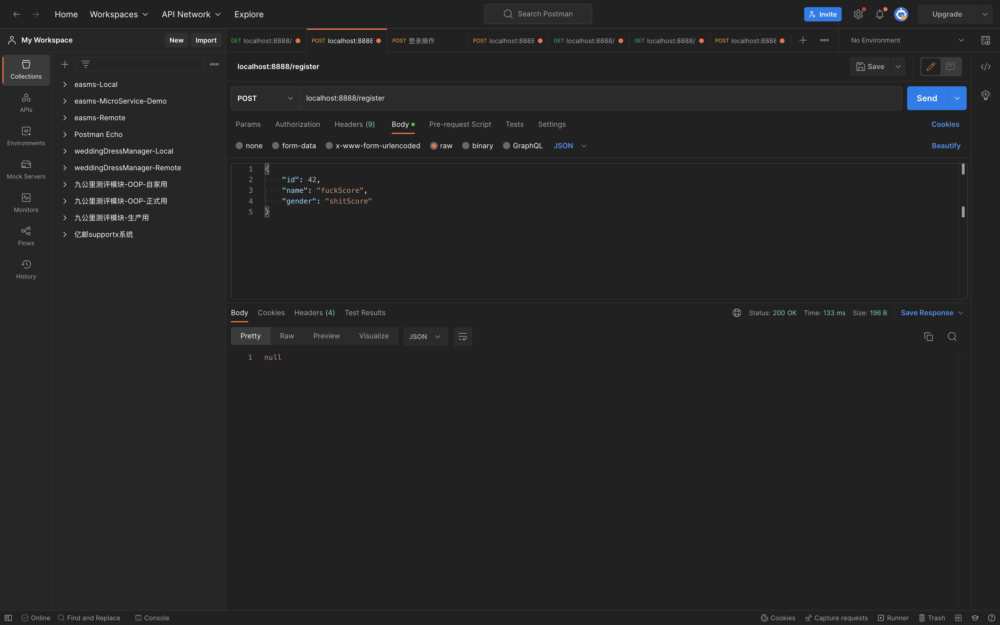

# 分布式事务(2)

## PART1. 准备工作

### 1.1 创建屏障表

```sql
USE `dtm_barrier`;
CREATE TABLE `barrier` (
  `id` bigint(22) NOT NULL AUTO_INCREMENT,
  `trans_type` varchar(45) DEFAULT '',
  `gid` varchar(128) DEFAULT '',
  `branch_id` varchar(128) DEFAULT '',
  `op` varchar(45) DEFAULT '',
  `barrier_id` varchar(45) DEFAULT '',
  `reason` varchar(45) DEFAULT '' COMMENT 'the branch type who insert this record',
  `create_time` datetime DEFAULT CURRENT_TIMESTAMP,
  `update_time` datetime DEFAULT CURRENT_TIMESTAMP,
  PRIMARY KEY (`id`),
  UNIQUE KEY `gid` (`gid`,`branch_id`,`op`,`barrier_id`),
  KEY `create_time` (`create_time`),
  KEY `update_time` (`update_time`)
) ENGINE=InnoDB DEFAULT CHARSET=utf8;
```

### 1.2 导入dtm的依赖

```
go get github.com/dtm-labs/dtm
go get github.com/dtm-labs/driver-gozero	# 这个包是go-zero对dtm的驱动
```

## PART2. user rpc服务中添加事务提交失败的callback

### 2.1 proto文件中定义callback

`user/rpc/user.proto`:

```proto
syntax = "proto3";

package user;

// protoc-gen-go 版本大于1.4.0, proto文件需要加上go_package,否则无法生成
option go_package = "./user";

message IdRequest {
  string id = 1;
}

message UserResponse {
  // 用户id
  string id = 1;
  // 用户名称
  string name = 2;
  // 用户性别
  string gender = 3;
}

message UserRequest {
  // 用户id
  string id = 1;
  // 用户名称
  string name = 2;
  // 用户性别
  string gender = 3;
}

service User {
  rpc getUser(IdRequest) returns(UserResponse);
  rpc saveUser(UserRequest) returns(UserResponse);
  rpc saveUserCallback(UserRequest) returns(UserResponse);
}
```

### 2.2 生成代码

```
(base) yanglei@192 user % cd rpc
(base) yanglei@192 rpc % ./gen.sh 
```

- 用生成的`user/rpc/types/user`下的文件替换`rpc-common/user/types/user`下的文件
- 用生成的`user/rpc/userclient`下的文件替换`rpc-common/user/userclient`下的文件(注意移动之后改一下import)
- 其他代码删除即可

### 2.3 logic层实现callback

`user/internal/logic/saveuserlogic.go`:

```go
package logic

import (
	"context"
	"database/sql"
	"fmt"
	"strconv"
	"user/internal/model"

	"rpc-common/user/types/user"
	"user/internal/svc"

	"github.com/zeromicro/go-zero/core/logx"
)

type SaveUserLogic struct {
	ctx    context.Context
	svcCtx *svc.ServiceContext
	logx.Logger
}

func NewSaveUserLogic(ctx context.Context, svcCtx *svc.ServiceContext) *SaveUserLogic {
	return &SaveUserLogic{
		ctx:    ctx,
		svcCtx: svcCtx,
		Logger: logx.WithContext(ctx),
	}
}

func (l *SaveUserLogic) SaveUser(in *user.UserRequest) (*user.UserResponse, error) {
	// todo: add your logic here and delete this line
	ctx := context.Background()
	userModel := &model.User{
		Name: sql.NullString{
			String: in.Name,
		},
		Gender: sql.NullString{
			String: in.Gender,
		},
	}
	err := l.svcCtx.UserRepo.Save(ctx, userModel)
	if err != nil {
		return nil, err
	}
	respId := strconv.FormatInt(userModel.Id, 10)
	return &user.UserResponse{
		Id:     respId,
		Name:   in.Name,
		Gender: in.Gender,
	}, nil
}

func (l *SaveUserLogic) SaveUserCallback(in *user.UserRequest) (*user.UserResponse, error) {
	fmt.Println("save user call back...")
	return &user.UserResponse{}, nil
}
```

### 2.4 server层调用logic层

`user/internal/server/userserver.go`:

```go
// Code generated by goctl. DO NOT EDIT.
// Source: user.proto

package server

import (
	"context"

	"user/internal/logic"
	"user/internal/svc"
	"rpc-common/user/types/user"
)

type UserServer struct {
	svcCtx *svc.ServiceContext
	user.UnimplementedUserServer
}

func NewUserServer(svcCtx *svc.ServiceContext) *UserServer {
	return &UserServer{
		svcCtx: svcCtx,
	}
}

func (s *UserServer) GetUser(ctx context.Context, in *user.IdRequest) (*user.UserResponse, error) {
	l := logic.NewGetUserLogic(ctx, s.svcCtx)
	return l.GetUser(in)
}

func (s *UserServer) SaveUser(ctx context.Context, in *user.UserRequest) (*user.UserResponse, error) {
	l := logic.NewSaveUserLogic(ctx, s.svcCtx)
	return l.SaveUser(in)
}

func (s *UserServer) SaveUserCallback(ctx context.Context, in *user.UserRequest) (*user.UserResponse, error) {
	l := logic.NewSaveUserLogic(ctx, s.svcCtx)
	return l.SaveUserCallback(in)
}
```

## PART3. 修改user rpc的`saveUser()`方法,在传参时传入user_id

由于分布式事务是由dtm server来完成rpc调用的,所以在创建用户信息之后,无法拿到该用户信息的id.所以本例中采取的解决方案是从外部传入一个userId.

### 3.1 logic层传入user_id

`user/internal/logic/saveuserlogic.go`:

```go
package logic

import (
	"context"
	"database/sql"
	"fmt"
	"strconv"
	"user/internal/model"

	"rpc-common/user/types/user"
	"user/internal/svc"

	"github.com/zeromicro/go-zero/core/logx"
)

type SaveUserLogic struct {
	ctx    context.Context
	svcCtx *svc.ServiceContext
	logx.Logger
}

func NewSaveUserLogic(ctx context.Context, svcCtx *svc.ServiceContext) *SaveUserLogic {
	return &SaveUserLogic{
		ctx:    ctx,
		svcCtx: svcCtx,
		Logger: logx.WithContext(ctx),
	}
}

func (l *SaveUserLogic) SaveUser(in *user.UserRequest) (*user.UserResponse, error) {
	// todo: add your logic here and delete this line
	id, _ := strconv.ParseInt(in.Id, 10, 64)
	ctx := context.Background()
	userModel := &model.User{
		Id: id,
		Name: sql.NullString{
			String: in.Name,
		},
		Gender: sql.NullString{
			String: in.Gender,
		},
	}
	err := l.svcCtx.UserRepo.Save(ctx, userModel)
	if err != nil {
		return nil, err
	}
	respId := strconv.FormatInt(userModel.Id, 10)
	return &user.UserResponse{
		Id:     respId,
		Name:   in.Name,
		Gender: in.Gender,
	}, nil
}

func (l *SaveUserLogic) SaveUserCallback(in *user.UserRequest) (*user.UserResponse, error) {
	fmt.Println("save user call back...")
	return &user.UserResponse{}, nil
}
```

此处在`SaveUser()`方法中将获取到的id字段值传给了dao层

### 3.2 dao层使用user_id

`user/internal/dao/user.go`:

```go
package dao

import (
	"context"
	"fmt"
	"github.com/zeromicro/go-zero/core/stores/sqlx"
	"user/database"
	"user/internal/model"
)

// cacheUserIdPrefix 使用缓存时的key前缀
var cacheUserIdPrefix = "cache:user:id:"

type UserDao struct {
	Conn *database.DBConn
}

func NewUserDao(conn *database.DBConn) *UserDao {
	return &UserDao{
		Conn: conn,
	}
}

func (u *UserDao) Save(ctx context.Context, user *model.User) error {
	sql := fmt.Sprintf("INSERT INTO %s (`id`, `name`, `gender`) VALUES (?, ?, ?)", user.TableName())
	result, err := u.Conn.Conn.ExecCtx(ctx, sql, user.Id, user.Name.String, user.Gender.String)
	if err != nil {
		return err
	}

	id, err := result.LastInsertId()
	if err != nil {
		return err
	}

	user.Id = id
	return nil
}

func (u *UserDao) FindById(ctx context.Context, id int64) (user *model.User, err error) {
	user = &model.User{}
	sql := fmt.Sprintf("SELECT * FROM %s WHERE `id` = ?", user.TableName())
	// 数据在redis中的key名
	userIdKey := fmt.Sprintf("%s:%d", cacheUserIdPrefix, id)
	// 使用带有cache的连接
	err = u.Conn.ConnCache.QueryRowCtx(ctx, user, userIdKey, func(ctx context.Context, conn sqlx.SqlConn, v any) error {
		return conn.QueryRowCtx(ctx, v, sql, id)
	})

	return user, err
}
```

注:这两步操作,实际上是因为分布式事务中,对rpc服务的调用是dtm server来完成的,user api层作为dtm server的client,无法拿到对rpc服务调用的返回值.但添加积分时,又需要user_id字段的值,所以这里的调整是为了让user api层能够将id传入而作的.

## PART4. 修改user-score rpc服务

此处由于需要将user-score服务的`saveUserScore()`方法是由dtm server发起调用的,那么需要让该方法返回一个结果,该结果表示事务执行是否成功.

### 4.1 在资源池中添加字段

`user-score/internal/svc/servicecontext.go`:

```go
package svc

import (
	"database/sql"
	"user-score/database"
	"user-score/internal/config"
	"user-score/internal/dao"
	"user-score/internal/repo"
)

type ServiceContext struct {
	Config        config.Config
	UserScoreRepo repo.UserScoreRepo
	DB            *sql.DB
}

func NewServiceContext(c config.Config) *ServiceContext {
	connect := database.Connect(c.MySQL.DataSource, c.CacheRedis)
	db, _ := connect.Conn.RawDB()
	return &ServiceContext{
		Config:        c,
		UserScoreRepo: dao.NewUserScoreDao(connect),
		DB:            db,
	}
}
```

### 4.2 logic层调用dtm提交事务

`user-score/internal/logic/saveuserscorelogic.go`:

```go
package logic

import (
	"context"
	"database/sql"
	"github.com/dtm-labs/dtm/client/dtmgrpc"
	"google.golang.org/grpc/codes"
	"google.golang.org/grpc/status"
	"user-score/internal/model"

	_ "github.com/dtm-labs/driver-gozero"
	"github.com/zeromicro/go-zero/core/logx"
	"rpc-common/user-score/types/score"
	"user-score/internal/svc"
)

type SaveUserScoreLogic struct {
	ctx    context.Context
	svcCtx *svc.ServiceContext
	logx.Logger
}

func NewSaveUserScoreLogic(ctx context.Context, svcCtx *svc.ServiceContext) *SaveUserScoreLogic {
	return &SaveUserScoreLogic{
		ctx:    ctx,
		svcCtx: svcCtx,
		Logger: logx.WithContext(ctx),
	}
}

func (l *SaveUserScoreLogic) SaveUserScore(in *score.UserScoreRequest) (*score.UserScoreResponse, error) {
	// todo: add your logic here and delete this line
	// 从grpc的上下文中生成一个拦截器
	barrier, err := dtmgrpc.BarrierFromGrpc(l.ctx)
	if err != nil {
		// 此处失败不用回滚 codes.Internal表示重试
		return nil, status.Error(codes.Internal, err.Error())
	}

	userScore := &model.UserScore{
		UserId: in.UserId,
		Score:  int(in.Score),
	}

	// 此处其实是又起了一个MySQL连接(也就是*sql.Tx) 用这个新连接去做的事务提交
	err = barrier.CallWithDB(l.svcCtx.DB, func(tx *sql.Tx) error {
		return l.svcCtx.UserScoreRepo.SaveUserScore(tx, context.Background(), userScore)
	})

	if err != nil {
		// codes.Aborted表示需要回滚
		return nil, status.Error(codes.Aborted, err.Error())
	}
	return &score.UserScoreResponse{
		UserId: userScore.UserId,
		Score:  int32(userScore.Score),
	}, nil
}
```

此处先生成拦截器,然后在拦截器中执行的数据库操作.生成拦截器若失败则重试,执行数据库操作失败则回滚.

```
go mod tidy
```

### 4.3 修改repo

`user-score/internal/repo/userscore.go`:

```go
package repo

import (
	"context"
	"database/sql"
	"user-score/internal/model"
)

type UserScoreRepo interface {
	SaveUserScore(tx *sql.Tx, ctx context.Context, user *model.UserScore) error
	FindById(ctx context.Context, id int64) (*model.UserScore, error)
}
```

### 4.4 dao层使用新连接执行sql

`user-score/internal/dao/userscore.go`:

```go
package dao

import (
	"context"
	"database/sql"
	"fmt"
	"github.com/zeromicro/go-zero/core/stores/sqlx"
	"user-score/database"
	"user-score/internal/model"
)

// cacheUserIdPrefix 使用缓存时的key前缀
var cacheUserScoreIdPrefix = "cache:user-score:id:"

type UserScoreDao struct {
	Conn *database.DBConn
}

func NewUserScoreDao(conn *database.DBConn) *UserScoreDao {
	return &UserScoreDao{
		Conn: conn,
	}
}

func (u *UserScoreDao) SaveUserScore(tx *sql.Tx, ctx context.Context, user *model.UserScore) error {
	sql := fmt.Sprintf("INSERT INTO %s (`user_id`, `score`) VALUES (?, ?)", user.TableName())
	result, err := tx.ExecContext(ctx, sql, user.UserId, user.Score)
	if err != nil {
		return err
	}

	id, err := result.LastInsertId()
	if err != nil {
		return err
	}

	user.Id = id
	return nil
}

func (u *UserScoreDao) FindById(ctx context.Context, id int64) (user *model.UserScore, err error) {
	user = &model.UserScore{}
	sql := fmt.Sprintf("SELECT * FROM %s WHERE `id` = ?", user.TableName())
	// 数据在redis中的key名
	userIdKey := fmt.Sprintf("%s:%d", cacheUserScoreIdPrefix, id)
	// 使用带有cache的连接
	err = u.Conn.ConnCache.QueryRowCtx(ctx, user, userIdKey, func(ctx context.Context, conn sqlx.SqlConn, v any) error {
		return conn.QueryRowCtx(ctx, v, sql, id)
	})

	return user, err
}
```

此处`SaveUserScore()`方法中,使用的是`&sql.Tx`执行的sql.

## PART5. 修改user rpc服务

PART4的操作再在user rpc服务中写一次即可.

### 5.1 在资源池中添加字段

`user/internal/svc/servicecontext.go`:

```go
package svc

import (
	"database/sql"
	"user/database"
	"user/internal/config"
	"user/internal/dao"
	"user/internal/repo"
)

type ServiceContext struct {
	Config   config.Config
	UserRepo repo.UserRepo
	DB       *sql.DB
}

func NewServiceContext(c config.Config) *ServiceContext {
	connect := database.Connect(c.MySQL.DataSource, c.CacheRedis)
	db, _ := connect.Conn.RawDB()
	return &ServiceContext{
		Config:   c,
		UserRepo: dao.NewUserDao(connect),
		DB:       db,
	}
}
```

### 5.2 logic层调用dtm提交事务

`user/internal/logic/saveuserlogic.go`:

```go
package logic

import (
	"context"
	"database/sql"
	"fmt"
	"github.com/dtm-labs/dtm/client/dtmgrpc"
	"google.golang.org/grpc/codes"
	"google.golang.org/grpc/status"
	"strconv"
	"user/internal/model"

	"rpc-common/user/types/user"
	"user/internal/svc"

	_ "github.com/dtm-labs/driver-gozero"
	"github.com/zeromicro/go-zero/core/logx"
)

type SaveUserLogic struct {
	ctx    context.Context
	svcCtx *svc.ServiceContext
	logx.Logger
}

func NewSaveUserLogic(ctx context.Context, svcCtx *svc.ServiceContext) *SaveUserLogic {
	return &SaveUserLogic{
		ctx:    ctx,
		svcCtx: svcCtx,
		Logger: logx.WithContext(ctx),
	}
}

func (l *SaveUserLogic) SaveUser(in *user.UserRequest) (*user.UserResponse, error) {
	// 此处从grpc的上下文中生成一个拦截器
	barrier, err := dtmgrpc.BarrierFromGrpc(l.ctx)
	if err != nil {
		// 此处失败不用回滚 codes.Internal表示重试
		return nil, status.Error(codes.Internal, err.Error())
	}

	id, _ := strconv.ParseInt(in.Id, 10, 64)
	ctx := context.Background()
	userModel := &model.User{
		Id: id,
		Name: sql.NullString{
			String: in.Name,
		},
		Gender: sql.NullString{
			String: in.Gender,
		},
	}

	// 此处其实是又起了一个MySQL连接(*sql.Tx) 用这个新连接去做的事务提交
	err = barrier.CallWithDB(l.svcCtx.DB, func(tx *sql.Tx) error {
		return l.svcCtx.UserRepo.Save(tx, ctx, userModel)
	})

	if err != nil {
		// codes.Aborted表示需要回滚
		return nil, status.Error(codes.Aborted, err.Error())
	}

	respId := strconv.FormatInt(userModel.Id, 10)
	return &user.UserResponse{
		Id:     respId,
		Name:   in.Name,
		Gender: in.Gender,
	}, nil
}

func (l *SaveUserLogic) SaveUserCallback(in *user.UserRequest) (*user.UserResponse, error) {
	fmt.Println("save user call back...")
	return &user.UserResponse{}, nil
}
```

```
go mod tidy
```

### 5.3 修改repo

`user/internal/repo/user.go`:

```go
package repo

import (
	"context"
	"database/sql"
	"user/internal/model"
)

type UserRepo interface {
	Save(tx *sql.Tx, ctx context.Context, user *model.User) error
	FindById(ctx context.Context, id int64) (*model.User, error)
}
```

### 5.4 dao层使用新连接执行sql

`user/internal/dao/user.go`:

```go
package dao

import (
	"context"
	"database/sql"
	"fmt"
	"github.com/zeromicro/go-zero/core/stores/sqlx"
	"user/database"
	"user/internal/model"
)

// cacheUserIdPrefix 使用缓存时的key前缀
var cacheUserIdPrefix = "cache:user:id:"

type UserDao struct {
	Conn *database.DBConn
}

func NewUserDao(conn *database.DBConn) *UserDao {
	return &UserDao{
		Conn: conn,
	}
}

func (u *UserDao) Save(tx *sql.Tx, ctx context.Context, user *model.User) error {
	sql := fmt.Sprintf("INSERT INTO %s (`id`, `name`, `gender`) VALUES (?, ?, ?)", user.TableName())
	result, err := tx.ExecContext(ctx, sql, user.Id, user.Name.String, user.Gender.String)
	if err != nil {
		return err
	}

	id, err := result.LastInsertId()
	if err != nil {
		return err
	}

	user.Id = id
	return nil
}

func (u *UserDao) FindById(ctx context.Context, id int64) (user *model.User, err error) {
	user = &model.User{}
	sql := fmt.Sprintf("SELECT * FROM %s WHERE `id` = ?", user.TableName())
	// 数据在redis中的key名
	userIdKey := fmt.Sprintf("%s:%d", cacheUserIdPrefix, id)
	// 使用带有cache的连接
	err = u.Conn.ConnCache.QueryRowCtx(ctx, user, userIdKey, func(ctx context.Context, conn sqlx.SqlConn, v any) error {
		return conn.QueryRowCtx(ctx, v, sql, id)
	})

	return user, err
}
```

## PART6. user api服务使用分布式事务

### 6.1 调整入参结构

`userapi/internal/types/types.go`:

```go
// Code generated by goctl. DO NOT EDIT.
package types

type Request struct {
	Id int64 `json:"id"`
	Name string `json:"name"`
	Gender string `json:"gender"`
}

type Response struct {
	Message string `json:"message"`
	Data any `json:"data"`
}

type GetUserRequest struct {
	Id string `path:"id"`
}

type GetUserResponse struct {
	Message string `json:"message"`
	Data any `json:"data"`
}

type LoginRequest struct {
	Username string `json:"username"`
	Password string `json:"password"`
}

type LoginResponse struct {
	Message string `json:"message"`
	Data any `json:"data"`
}
```

### 6.2 logic层使用分布式事务进行提交和回滚

`userapi/internal/logic/userapilogic.go`

```go
package logic

import (
	"context"
	"encoding/json"
	"fmt"
	"github.com/dtm-labs/dtm/client/dtmgrpc"
	"github.com/golang-jwt/jwt/v4"
	"rpc-common/user-score/types/score"
	"rpc-common/user/types/user"
	"strconv"
	"time"
	"userapi/internal/svc"
	"userapi/internal/types"

	_ "github.com/dtm-labs/driver-gozero"
	"github.com/zeromicro/go-zero/core/logx"
)

// dtmServer dtm的conf.yaml中配置的 dtm的注册地址
var dtmServer = "etcd://localhost:2379/dtmservice"

type UserapiLogic struct {
	logx.Logger
	ctx    context.Context
	svcCtx *svc.ServiceContext
}

func NewUserLogic(ctx context.Context, svcCtx *svc.ServiceContext) *UserapiLogic {
	return &UserapiLogic{
		Logger: logx.WithContext(ctx),
		ctx:    ctx,
		svcCtx: svcCtx,
	}
}

func (l *UserapiLogic) Userapi(req *types.Request) (resp *types.Response, err error) {
	// todo: add your logic here and delete this line

	return
}

func (l *UserapiLogic) Register(req *types.Request) (resp *types.Response, err error) {
	// todo: add your logic here and delete this line
	// 一般做超时上下文
	//ctx, cancelFunc := context.WithTimeout(context.Background(), 5*time.Second)
	//defer cancelFunc()

	// SaveUser和SaveUserScore 纳入到1个事务中
	// dtm client把grpc调用提交给dtm server,由dtm server来完成调用

	// 生成组id
	gid := dtmgrpc.MustGenGid(dtmServer)
	// 使用SAGA模式
	sagaGrpc := dtmgrpc.NewSagaGrpc(dtmServer, gid)

	// 定义grpc调用 让dtm client交给dtm server来完成调用
	userRpcServer, err := l.svcCtx.Config.UserRpc.BuildTarget()
	if err != nil {
		return nil, err
	}

	// 此处后边的形似路由的部分是user_grpc.pb.go中的常量 User_SaveUser_FullMethodName 的值
	// saveUserAction表示要让dtm server调用的 user rpc服务的路由
	saveUserAction := userRpcServer + "/user.User/saveUser"

	// saveUserCallbackAction 表示当事务提交失败 需要回滚时调用的 user rpc服务的路由
	saveUserCallbackAction := userRpcServer + "/user.User/saveUserCallback"

	// 此处的saveReq 表示调用user rpc服务的"/user.User/saveUser"时的参数
	idStr := strconv.FormatInt(req.Id, 10)
	saveReq := &user.UserRequest{
		Id:     idStr,
		Name:   req.Name,
		Gender: req.Gender,
	}

	// 让dtm server 对user rpc服务做调用和回调
	sagaGrpc.Add(saveUserAction, saveUserCallbackAction, saveReq)

	// 让dtm server 对user-score rpc服务做调用和回调
	scoreRpcServer, err := l.svcCtx.Config.UserScoreRpc.BuildTarget()
	if err != nil {
		return nil, err
	}
	saveScoreAction := scoreRpcServer + "/score.UserScore/saveUserScore"
	saveScoreActionCallback := scoreRpcServer + "/score.UserScore/saveUserScoreCallback"
	saveScoreReq := &score.UserScoreRequest{
		// Tips: 此处由于对user rpc服务的调用是由dtm server来完成的 所以在这里是拿不到user rpc服务的返回值的
		// Tips: 也就是说说是拿不到user_id的 所以先随便写一个
		// TODO: 这TM生产咋整 = =
		UserId: req.Id,
		Score:  10,
	}
	sagaGrpc.Add(saveScoreAction, saveScoreActionCallback, saveScoreReq)
	// 等待提交结果 可以认为设置的是同步提交
	sagaGrpc.WaitResult = true
	err = sagaGrpc.Submit()

	if err != nil {
		fmt.Printf("submit transaction error: %#v\n", err.Error())
		return nil, err
	}

	return resp, nil
}

func (l *UserapiLogic) GetUser(t *types.GetUserRequest) (resp *types.GetUserResponse, err error) {
	// 认证通过后 从token中获取userId
	userId := l.ctx.Value("userId")
	logx.Info("获取到的token内容为: %s \n", userId)
	userIdStr := string(userId.(json.Number))
	ctx, cancelFunc := context.WithTimeout(context.Background(), 5*time.Second)
	defer cancelFunc()
	// 此处由于发放token时向上下文中存入的userId就是1 故从上下文中拿到的userId值肯定是1
	// 所以必然触发错误
	//if userIdStr == "1" {
	//	return nil, bizError.ParamError
	//}
	userResponse, err := l.svcCtx.UserRpc.GetUser(ctx, &user.IdRequest{Id: userIdStr})
	if err != nil {
		return nil, err
	}
	resp = &types.GetUserResponse{
		Message: "success",
		Data:    userResponse,
	}
	return resp, nil
}

func (l *UserapiLogic) Login(t *types.LoginRequest) (resp *types.LoginResponse, err error) {
	fmt.Printf("正在执行Login方法\n")
	userId := 1
	secret := l.svcCtx.Config.Auth.Secret
	expireIn := l.svcCtx.Config.Auth.ExpireIn
	signAt := time.Now().Unix()
	token, err := genToken(secret, signAt, expireIn, int64(userId))
	if err != nil {
		return nil, err
	}
	resp = &types.LoginResponse{
		Message: "success",
		Data: map[string]string{
			"token": token,
		},
	}
	return resp, nil
}

// genToken 生成token
// secret:密钥
// signAt: 签发时间
// expireIn: token生命周期
// userId: 用户ID
func genToken(secret string, signAt, expireIn, userId int64) (string, error) {
	claims := make(jwt.MapClaims)
	// Tips: 以下2个key的值是jwt.MapClaims预制的 必须这么写key值
	claims["exp"] = signAt + expireIn
	claims["iat"] = signAt
	// Tips: 这个key的值可以自定义的 后续验证token通过后 该K-V将会被存入上下文中
	claims["userId"] = userId
	token := jwt.New(jwt.SigningMethodHS256)
	token.Claims = claims
	return token.SignedString([]byte(secret))
}
```

```
go mod tidy
```

## PART7. 测试

