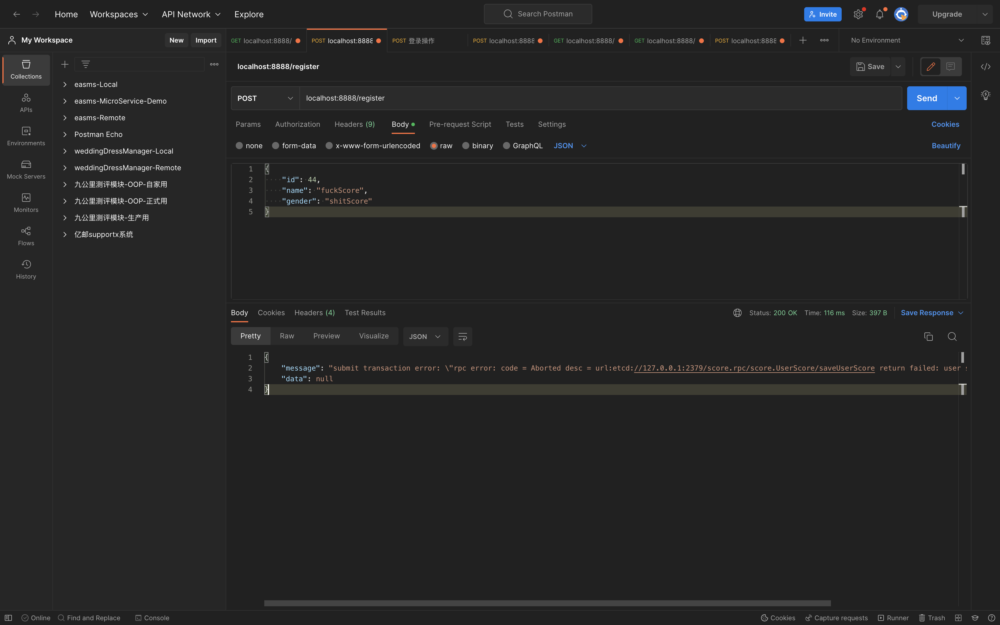

# 分布式事务(3)

上节课实现了使用分布式事务添加数据,但是还没有实现当添加失败需要回滚时调用的callback函数.

## PART1. 制造错误以触发callback

`user-score/internal/logic/saveuserscorelogic.go`

```go
package logic

import (
	"context"
	"database/sql"
	"errors"
	"github.com/dtm-labs/dtm/client/dtmgrpc"
	"google.golang.org/grpc/codes"
	"google.golang.org/grpc/status"
	"user-score/internal/model"

	_ "github.com/dtm-labs/driver-gozero"
	"github.com/zeromicro/go-zero/core/logx"
	"rpc-common/user-score/types/score"
	"user-score/internal/svc"
)

type SaveUserScoreLogic struct {
	ctx    context.Context
	svcCtx *svc.ServiceContext
	logx.Logger
}

func NewSaveUserScoreLogic(ctx context.Context, svcCtx *svc.ServiceContext) *SaveUserScoreLogic {
	return &SaveUserScoreLogic{
		ctx:    ctx,
		svcCtx: svcCtx,
		Logger: logx.WithContext(ctx),
	}
}

func (l *SaveUserScoreLogic) SaveUserScore(in *score.UserScoreRequest) (*score.UserScoreResponse, error) {
	// todo: add your logic here and delete this line
	// 从grpc的上下文中生成一个拦截器
	barrier, err := dtmgrpc.BarrierFromGrpc(l.ctx)
	if err != nil {
		// 此处失败不用回滚 codes.Internal表示重试
		return nil, status.Error(codes.Internal, err.Error())
	}

	userScore := &model.UserScore{
		UserId: in.UserId,
		Score:  int(in.Score),
	}

	// 此处其实是又起了一个MySQL连接(也就是*sql.Tx) 用这个新连接去做的事务提交
	err = barrier.CallWithDB(l.svcCtx.DB, func(tx *sql.Tx) error {
		// 人为制造一个错误以触发callback
		if userScore.Score == 10 {
			return errors.New("user score can't equal 10")
		}
		
		return l.svcCtx.UserScoreRepo.SaveUserScore(tx, context.Background(), userScore)
	})

	if err != nil {
		// codes.Aborted表示需要回滚
		return nil, status.Error(codes.Aborted, err.Error())
	}
	return &score.UserScoreResponse{
		UserId: userScore.UserId,
		Score:  int32(userScore.Score),
	}, nil
}
```

此时调用`register`时,会出现一个情况:`zero_mall.user`表中的数据被插入了,但`dtm_barrier`表中的数据插入失败了.也就是说这个事务没有满足原子性.这是因为我们的callback函数中还没有做补偿操作.

## PART2. 查看dtm的源码

`$GOPATH/pkg/mod/github.com/dtm-labs/dtm@v1.17.1/client/dtmcli/barrier.go`:

第63行:

```go
// Call see detail description in https://en.dtm.pub/practice/barrier.html
// tx: local transaction connection
// busiCall: busi func
func (bb *BranchBarrier) Call(tx *sql.Tx, busiCall BarrierBusiFunc) (rerr error) {
	bid := bb.newBarrierID()
	defer dtmimp.DeferDo(&rerr, func() error {
		return tx.Commit()
	}, func() error {
		return tx.Rollback()
	})
	...
}
```

可以看到,如果事务已经成功提交,那就没有办法再回滚了.所以只能是通过向dtm server传递一个callback的方式来进行回滚,也就是补偿.

## PART3. user prc服务实现补偿

### 3.1 repo层定义删除操作

`user/internal/repo/user.go`:

```go
package repo

import (
	"context"
	"database/sql"
	"user/internal/model"
)

type UserRepo interface {
	Save(tx *sql.Tx, ctx context.Context, user *model.User) error
	FindById(ctx context.Context, id int64) (*model.User, error)
	DeleteById(ctx context.Context, id int64) error
}
```

### 3.2 dao层实现删除操作

`user/internal/dao/user.go`:

```go
package dao

import (
	"context"
	"database/sql"
	"fmt"
	"github.com/zeromicro/go-zero/core/stores/sqlx"
	"user/database"
	"user/internal/model"
)

// cacheUserIdPrefix 使用缓存时的key前缀
var cacheUserIdPrefix = "cache:user:id:"

type UserDao struct {
	Conn *database.DBConn
}

func NewUserDao(conn *database.DBConn) *UserDao {
	return &UserDao{
		Conn: conn,
	}
}

func (u *UserDao) Save(tx *sql.Tx, ctx context.Context, user *model.User) error {
	sql := fmt.Sprintf("INSERT INTO %s (`id`, `name`, `gender`) VALUES (?, ?, ?)", user.TableName())
	result, err := tx.ExecContext(ctx, sql, user.Id, user.Name.String, user.Gender.String)
	if err != nil {
		return err
	}

	id, err := result.LastInsertId()
	if err != nil {
		return err
	}

	user.Id = id
	return nil
}

func (u *UserDao) FindById(ctx context.Context, id int64) (user *model.User, err error) {
	user = &model.User{}
	sql := fmt.Sprintf("SELECT * FROM %s WHERE `id` = ?", user.TableName())
	// 数据在redis中的key名
	userIdKey := fmt.Sprintf("%s:%d", cacheUserIdPrefix, id)
	// 使用带有cache的连接
	err = u.Conn.ConnCache.QueryRowCtx(ctx, user, userIdKey, func(ctx context.Context, conn sqlx.SqlConn, v any) error {
		return conn.QueryRowCtx(ctx, v, sql, id)
	})

	return user, err
}

func (u *UserDao) DeleteById(ctx context.Context, id int64) error {
	user := &model.User{}
	sql := fmt.Sprintf("DELETE FROM %s WHERE `id` = ?", user.TableName())
	_, err := u.Conn.Conn.ExecCtx(ctx, sql, id)
	if err != nil {
		return err
	}
	return nil
}
```

### 3.3 logic层调用dao层删除数据,以实现补偿

`user/internal/logic/saveuserlogic.go`:

```go
package logic

import (
	"context"
	"database/sql"
	"github.com/dtm-labs/dtm/client/dtmgrpc"
	"google.golang.org/grpc/codes"
	"google.golang.org/grpc/status"
	"strconv"
	"user/internal/model"

	"rpc-common/user/types/user"
	"user/internal/svc"

	_ "github.com/dtm-labs/driver-gozero"
	"github.com/zeromicro/go-zero/core/logx"
)

type SaveUserLogic struct {
	ctx    context.Context
	svcCtx *svc.ServiceContext
	logx.Logger
}

func NewSaveUserLogic(ctx context.Context, svcCtx *svc.ServiceContext) *SaveUserLogic {
	return &SaveUserLogic{
		ctx:    ctx,
		svcCtx: svcCtx,
		Logger: logx.WithContext(ctx),
	}
}

func (l *SaveUserLogic) SaveUser(in *user.UserRequest) (*user.UserResponse, error) {
	// 此处从grpc的上下文中生成一个拦截器
	barrier, err := dtmgrpc.BarrierFromGrpc(l.ctx)
	if err != nil {
		// 此处失败不用回滚 codes.Internal表示重试
		return nil, status.Error(codes.Internal, err.Error())
	}

	id, _ := strconv.ParseInt(in.Id, 10, 64)
	ctx := context.Background()
	userModel := &model.User{
		Id: id,
		Name: sql.NullString{
			String: in.Name,
		},
		Gender: sql.NullString{
			String: in.Gender,
		},
	}

	// 此处其实是又起了一个MySQL连接(*sql.Tx) 用这个新连接去做的事务提交
	err = barrier.CallWithDB(l.svcCtx.DB, func(tx *sql.Tx) error {
		return l.svcCtx.UserRepo.Save(tx, ctx, userModel)
	})

	if err != nil {
		// codes.Aborted表示需要回滚
		return nil, status.Error(codes.Aborted, err.Error())
	}

	respId := strconv.FormatInt(userModel.Id, 10)
	return &user.UserResponse{
		Id:     respId,
		Name:   in.Name,
		Gender: in.Gender,
	}, nil
}

func (l *SaveUserLogic) SaveUserCallback(in *user.UserRequest) (*user.UserResponse, error) {
	// 在回调中进行补偿操作 如果事务是插入数据 那么回调中就是删除数据
	// 此处以回滚为例 删除数据
	ctx := context.Background()
	id, _ := strconv.ParseInt(in.Id, 10, 64)
	err := l.svcCtx.UserRepo.DeleteById(ctx, id)
	if err != nil {
		return nil, err
	}
	return &user.UserResponse{}, nil
}
```

## PART4. user-score prc服务实现补偿

### 4.1 repo层定义删除操作

`user-score/internal/repo/userscore.go`:

```go
package repo

import (
	"context"
	"database/sql"
	"user-score/internal/model"
)

type UserScoreRepo interface {
	SaveUserScore(tx *sql.Tx, ctx context.Context, user *model.UserScore) error
	FindById(ctx context.Context, id int64) (*model.UserScore, error)
	DeleteByUserId(ctx context.Context, userId int64) error
}
```

### 4.2 dao层实现删除操作

`user-score/internal/dao/userscore.go`:

```go
package dao

import (
	"context"
	"database/sql"
	"fmt"
	"github.com/zeromicro/go-zero/core/stores/sqlx"
	"user-score/database"
	"user-score/internal/model"
)

// cacheUserIdPrefix 使用缓存时的key前缀
var cacheUserScoreIdPrefix = "cache:user-score:id:"

type UserScoreDao struct {
	Conn *database.DBConn
}

func NewUserScoreDao(conn *database.DBConn) *UserScoreDao {
	return &UserScoreDao{
		Conn: conn,
	}
}

func (u *UserScoreDao) SaveUserScore(tx *sql.Tx, ctx context.Context, user *model.UserScore) error {
	sql := fmt.Sprintf("INSERT INTO %s (`user_id`, `score`) VALUES (?, ?)", user.TableName())
	result, err := tx.ExecContext(ctx, sql, user.UserId, user.Score)
	if err != nil {
		return err
	}

	id, err := result.LastInsertId()
	if err != nil {
		return err
	}

	user.Id = id
	return nil
}

func (u *UserScoreDao) FindById(ctx context.Context, id int64) (user *model.UserScore, err error) {
	user = &model.UserScore{}
	sql := fmt.Sprintf("SELECT * FROM %s WHERE `id` = ?", user.TableName())
	// 数据在redis中的key名
	userIdKey := fmt.Sprintf("%s:%d", cacheUserScoreIdPrefix, id)
	// 使用带有cache的连接
	err = u.Conn.ConnCache.QueryRowCtx(ctx, user, userIdKey, func(ctx context.Context, conn sqlx.SqlConn, v any) error {
		return conn.QueryRowCtx(ctx, v, sql, id)
	})

	return user, err
}

func (u *UserScoreDao) DeleteByUserId(ctx context.Context, userId int64) error {
	userScore := &model.UserScore{}
	sql := fmt.Sprintf("DELETE FROM %s WHERE `user_id` = ?", userScore.TableName())
	_, err := u.Conn.Conn.ExecCtx(ctx, sql, userId)
	if err != nil {
		return err
	}
	return nil
}
```

### 4.3 logic层调用dao层删除数据,以实现补偿

`user-score/internal/logic/saveuserscorecallbacklogic.go`:

```go
package logic

import (
	"context"
	"github.com/zeromicro/go-zero/core/logx"
	"rpc-common/user-score/types/score"
	"user-score/internal/svc"
)

type SaveUserScoreCallbackLogic struct {
	ctx    context.Context
	svcCtx *svc.ServiceContext
	logx.Logger
}

func NewSaveUserScoreCallbackLogic(ctx context.Context, svcCtx *svc.ServiceContext) *SaveUserScoreCallbackLogic {
	return &SaveUserScoreCallbackLogic{
		ctx:    ctx,
		svcCtx: svcCtx,
		Logger: logx.WithContext(ctx),
	}
}

// SaveUserScoreCallback 分布式事务中提交失败之后 回滚时需要执行一个callback
func (l *SaveUserScoreCallbackLogic) SaveUserScoreCallback(in *score.UserScoreRequest) (*score.UserScoreResponse, error) {
	ctx := context.Background()
	err := l.svcCtx.UserScoreRepo.DeleteByUserId(ctx, in.UserId)
	if err != nil {
		return nil, err
	}
	return &score.UserScoreResponse{}, nil
}
```

## PART5. user api服务美化错误

`userapi/internal/logic/userapilogic.go`:

```go
package logic

import (
	"context"
	"encoding/json"
	"fmt"
	"github.com/dtm-labs/dtm/client/dtmgrpc"
	"github.com/golang-jwt/jwt/v4"
	"rpc-common/user-score/types/score"
	"rpc-common/user/types/user"
	"strconv"
	"time"
	"userapi/internal/svc"
	"userapi/internal/types"

	_ "github.com/dtm-labs/driver-gozero"
	"github.com/zeromicro/go-zero/core/logx"
)

// dtmServer dtm的conf.yaml中配置的 dtm的注册地址
var dtmServer = "etcd://localhost:2379/dtmservice"

type UserapiLogic struct {
	logx.Logger
	ctx    context.Context
	svcCtx *svc.ServiceContext
}

func NewUserLogic(ctx context.Context, svcCtx *svc.ServiceContext) *UserapiLogic {
	return &UserapiLogic{
		Logger: logx.WithContext(ctx),
		ctx:    ctx,
		svcCtx: svcCtx,
	}
}

func (l *UserapiLogic) Userapi(req *types.Request) (resp *types.Response, err error) {
	// todo: add your logic here and delete this line

	return
}

func (l *UserapiLogic) Register(req *types.Request) (resp *types.Response, err error) {
	// todo: add your logic here and delete this line
	// 一般做超时上下文
	//ctx, cancelFunc := context.WithTimeout(context.Background(), 5*time.Second)
	//defer cancelFunc()

	// SaveUser和SaveUserScore 纳入到1个事务中
	// dtm client把grpc调用提交给dtm server,由dtm server来完成调用

	// 生成组id
	gid := dtmgrpc.MustGenGid(dtmServer)
	// 使用SAGA模式
	sagaGrpc := dtmgrpc.NewSagaGrpc(dtmServer, gid)

	// 定义grpc调用 让dtm client交给dtm server来完成调用
	userRpcServer, err := l.svcCtx.Config.UserRpc.BuildTarget()
	if err != nil {
		return nil, err
	}

	// 此处后边的形似路由的部分是user_grpc.pb.go中的常量 User_SaveUser_FullMethodName 的值
	// saveUserAction表示要让dtm server调用的 user rpc服务的路由
	saveUserAction := userRpcServer + "/user.User/saveUser"

	// saveUserCallbackAction 表示当事务提交失败 需要回滚时调用的 user rpc服务的路由
	saveUserCallbackAction := userRpcServer + "/user.User/saveUserCallback"

	// 此处的saveReq 表示调用user rpc服务的"/user.User/saveUser"时的参数
	idStr := strconv.FormatInt(req.Id, 10)
	saveReq := &user.UserRequest{
		Id:     idStr,
		Name:   req.Name,
		Gender: req.Gender,
	}

	// 让dtm server 对user rpc服务做调用和回调
	sagaGrpc.Add(saveUserAction, saveUserCallbackAction, saveReq)

	// 让dtm server 对user-score rpc服务做调用和回调
	scoreRpcServer, err := l.svcCtx.Config.UserScoreRpc.BuildTarget()
	if err != nil {
		return nil, err
	}
	saveScoreAction := scoreRpcServer + "/score.UserScore/saveUserScore"
	saveScoreActionCallback := scoreRpcServer + "/score.UserScore/saveUserScoreCallback"
	saveScoreReq := &score.UserScoreRequest{
		// Tips: 此处由于对user rpc服务的调用是由dtm server来完成的 所以在这里是拿不到user rpc服务的返回值的
		// Tips: 也就是说说是拿不到user_id的 所以先随便写一个
		// TODO: 这TM生产咋整 = =
		UserId: req.Id,
		Score:  10,
	}
	sagaGrpc.Add(saveScoreAction, saveScoreActionCallback, saveScoreReq)
	// 等待提交结果 可以认为设置的是同步提交
	sagaGrpc.WaitResult = true
	err = sagaGrpc.Submit()

	if err != nil {
		errMsg := fmt.Sprintf("submit transaction error: %#v", err.Error())
		response := &types.Response{
			Message: errMsg,
			Data:    nil,
		}
		return response, nil
	}

	return resp, nil
}

func (l *UserapiLogic) GetUser(t *types.GetUserRequest) (resp *types.GetUserResponse, err error) {
	// 认证通过后 从token中获取userId
	userId := l.ctx.Value("userId")
	logx.Info("获取到的token内容为: %s \n", userId)
	userIdStr := string(userId.(json.Number))
	ctx, cancelFunc := context.WithTimeout(context.Background(), 5*time.Second)
	defer cancelFunc()
	// 此处由于发放token时向上下文中存入的userId就是1 故从上下文中拿到的userId值肯定是1
	// 所以必然触发错误
	//if userIdStr == "1" {
	//	return nil, bizError.ParamError
	//}
	userResponse, err := l.svcCtx.UserRpc.GetUser(ctx, &user.IdRequest{Id: userIdStr})
	if err != nil {
		return nil, err
	}
	resp = &types.GetUserResponse{
		Message: "success",
		Data:    userResponse,
	}
	return resp, nil
}

func (l *UserapiLogic) Login(t *types.LoginRequest) (resp *types.LoginResponse, err error) {
	fmt.Printf("正在执行Login方法\n")
	userId := 1
	secret := l.svcCtx.Config.Auth.Secret
	expireIn := l.svcCtx.Config.Auth.ExpireIn
	signAt := time.Now().Unix()
	token, err := genToken(secret, signAt, expireIn, int64(userId))
	if err != nil {
		return nil, err
	}
	resp = &types.LoginResponse{
		Message: "success",
		Data: map[string]string{
			"token": token,
		},
	}
	return resp, nil
}

// genToken 生成token
// secret:密钥
// signAt: 签发时间
// expireIn: token生命周期
// userId: 用户ID
func genToken(secret string, signAt, expireIn, userId int64) (string, error) {
	claims := make(jwt.MapClaims)
	// Tips: 以下2个key的值是jwt.MapClaims预制的 必须这么写key值
	claims["exp"] = signAt + expireIn
	claims["iat"] = signAt
	// Tips: 这个key的值可以自定义的 后续验证token通过后 该K-V将会被存入上下文中
	claims["userId"] = userId
	token := jwt.New(jwt.SigningMethodHS256)
	token.Claims = claims
	return token.SignedString([]byte(secret))
}
```

## PART6. 测试



此时当user-score服务报错时,user服务插入的数据会删除,保持事务的原子性.