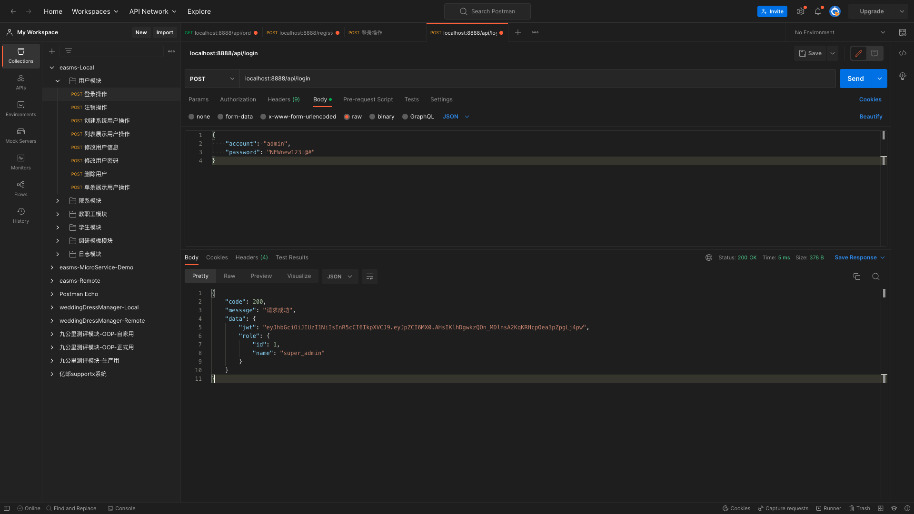

# rpc服务与api复习

## PART1. 初始化项目和工作空间

### 1.1 初始化项目

```
(base) yanglei@192 code % pwd
/Users/yanglei/Desktop/go-zero-study/goZeroStudy/复习/rpc服务与api/code
(base) yanglei@192 code % goctl api new user
Done.
(base) yanglei@192 code % goctl api new userapi
Done.
(base) yanglei@192 code % tree ./ -L 1
./
├── user
└── userapi

2 directories, 0 files
```

TODO:应该是有`goctl rpc new`之类的命令能创建rpc服务吧.这个需要去看文档了

### 1.2 初始化工作空间

```
(base) yanglei@192 code % go work init
(base) yanglei@192 code % go work use ./user
(base) yanglei@192 code % go work use ./userapi 
(base) yanglei@192 code % tree ./ -L 1
./
├── go.work
├── user
└── userapi

2 directories, 1 file
```

## PART2. 编写User rpc服务

### 2.1 创建proto文件

在`user`目录下创建目录`rpc`,在`user/rpc/`下创建文件`user.proto`,代码如下:

```proto
syntax = "proto3";

package user;

option go_package = "./user";

// LoginRequest 登录操作请求参数
message LoginRequest {
  // account 用户账户
  string account = 1;
  // password 用户密码
  string password = 2;
}

// LoginResponse 登录操作响应参数
message LoginResponse {
  // code 响应状态码
  int64 code = 1;
  // message 响应状态码对应信息
  string message = 2;
  // data 登录操作有效数据接哦股
  LoginData data = 3;
}

message LoginData {
  string jwt = 1;
  Role role = 2;
}

message Role {
  int64 id = 1;
  string name = 2;
}

service User {
  rpc Login(LoginRequest) returns (LoginResponse);
}
```

### 2.2 生成代码

```
(base) yanglei@192 user % pwd
/Users/yanglei/Desktop/go-zero-study/goZeroStudy/复习/rpc服务与api/code/user
(base) yanglei@192 user % cd rpc 
(base) yanglei@192 rpc % goctl rpc protoc user.proto --go_out=./types --go-grpc_out=./types --zrpc_out=.
Done.
```

生成后将`user/`下除`user/rpc`和`user/go.mod`之外所有的文件都删除.然后将`user/rpc`目录下除`user/rpc/user.proto`外所有的目录和文件都移动到`user/`下.

完成后目录结构如下:

```
(base) yanglei@192 user % tree ./ -L 1
./
├── etc
├── go.mod
├── internal
├── rpc
├── types
├── user.go
└── userclient

5 directories, 2 files
```

```
(base) yanglei@192 user % go mod tidy
```

### 2.3 初步填充逻辑

```go
package logic

import (
	"context"
	"user/internal/svc"
	"user/types/user"

	"github.com/zeromicro/go-zero/core/logx"
)

type LoginLogic struct {
	ctx    context.Context
	svcCtx *svc.ServiceContext
	logx.Logger
}

func NewLoginLogic(ctx context.Context, svcCtx *svc.ServiceContext) *LoginLogic {
	return &LoginLogic{
		ctx:    ctx,
		svcCtx: svcCtx,
		Logger: logx.WithContext(ctx),
	}
}

func (l *LoginLogic) Login(in *user.LoginRequest) (*user.LoginResponse, error) {
	// todo: add your logic here and delete this line
	resp := &user.LoginResponse{
		Code:    200,
		Message: "请求成功",
		Data: &user.LoginData{
			Jwt: "eyJhbGciOiJIUzI1NiIsInR5cCI6IkpXVCJ9.eyJpZCI6MX0.AHsIKlhDgwkzQOn_MDlnsA2KqKRHcpOea3pZpgLj4pw",
			Role: &user.Role{
				Id:   1,
				Name: "super_admin",
			},
		},
	}
	return resp, nil
}
```

此处先将返回结构体填充好,后续先测试api层能否成功访问到rpc服务,再回过头来填充逻辑.

## PART3. 编写 userapi服务

### 3.1 编写`userapi.api`

`userapi/userapi.api`:

```api
type LoginRequest {
	Account  string `json:"account"`
	Password string `json:"password"`
}

type LoginResponse {
	Code    int64      `json:"code"`
	Message string     `json:"message"`
	Data    *LoginData `json:"data"`
}

type LoginData {
	Jwt  string `json:"jwt"`
	Role *Role  `json:"role"`
}

type Role {
	Id   int64  `json:"id"`
	Name string `json:"name"`
}

service user-api {
	@handler login
	post /api/login (LoginRequest) returns (LoginResponse)
}
```

TODO:这个api文件有问题

### 3.2 根据`userapi.api`生成代码

```
(base) yanglei@192 code % cd userapi 
(base) yanglei@192 userapi % goctl api go -api userapi.api -dir ./gen
Done.
```

将`/userapi/gen/`下的所有目录和文件移动至`/userapi`下,全覆盖即可.注意覆盖后修改imports中的路径.全部完成后记得删除`userapi/gen`目录

### 3.3 新增配置

#### 3.3.1 配置文件中新增关于user prc服务的配置项

`userapi/etc/user-api.yaml`:

```yaml
Name: user-api
Host: 0.0.0.0
Port: 8888
# 此处的UserRpc 是自定义的一个字段名称 只要下边的UserRpc.Etcd.Key写的是user rpc服务的名称即可
UserRpc:
  Etcd:
    Hosts:
      - 127.0.0.1:2379
    Key: user.rpc
```

#### 3.3.2 在配置结构体中新增字段

`user/internal/config/config.go`:

```go
package config

import (
	"github.com/zeromicro/go-zero/rest"
	"github.com/zeromicro/go-zero/zrpc"
)

type Config struct {
	rest.RestConf
	UserRpc zrpc.RpcClientConf
}
```

#### 3.3.3 在资源池中建立rpc连接

`user/internal/svc/servicecontext.go`:

```go
package svc

import (
	"github.com/zeromicro/go-zero/zrpc"
	"user/userclient"
	"userapi/internal/config"
)

type ServiceContext struct {
	Config config.Config
	UserRpc userclient.User
}

func NewServiceContext(c config.Config) *ServiceContext {
	return &ServiceContext{
		Config: c,
		UserRpc: userclient.NewUser(zrpc.MustNewClient(c.UserRpc)),
	}
}
```

### 3.4 填充逻辑

此处为了先测试,确认api层是否能够和rpc层正常连接,逻辑层还是先不实现,只调用rpc服务.

`userapi/internal/logic/loginlogic.go`:

```go
package logic

import (
	"context"
	"time"
	"user/types/user"

	"userapi/internal/svc"
	"userapi/internal/types"

	"github.com/zeromicro/go-zero/core/logx"
)

type LoginLogic struct {
	logx.Logger
	ctx    context.Context
	svcCtx *svc.ServiceContext
}

func NewLoginLogic(ctx context.Context, svcCtx *svc.ServiceContext) *LoginLogic {
	return &LoginLogic{
		Logger: logx.WithContext(ctx),
		ctx:    ctx,
		svcCtx: svcCtx,
	}
}

func (l *LoginLogic) Login(req *types.LoginRequest) (resp *types.LoginResponse, err error) {
	// todo: add your logic here and delete this line
	ctx, cancelFunc := context.WithTimeout(context.Background(), 5*time.Second)
	defer cancelFunc()
	loginReq := &user.LoginRequest{
		Account:  req.Account,
		Password: req.Password,
	}
	loginResp, err := l.svcCtx.UserRpc.Login(ctx, loginReq)
	if err != nil {
		return nil, err
	}

	resp = &types.LoginResponse{
		Code:    loginResp.Code,
		Message: loginResp.Message,
		Data: &types.LoginData{
			Jwt: loginResp.Data.Jwt,
			Role: &types.Role{
				Id:   loginResp.Data.Role.Id,
				Name: loginResp.Data.Role.Name,
			},
		},
	}
	return
}
```

至此,测试代码编写完成

## PART4. 测试



