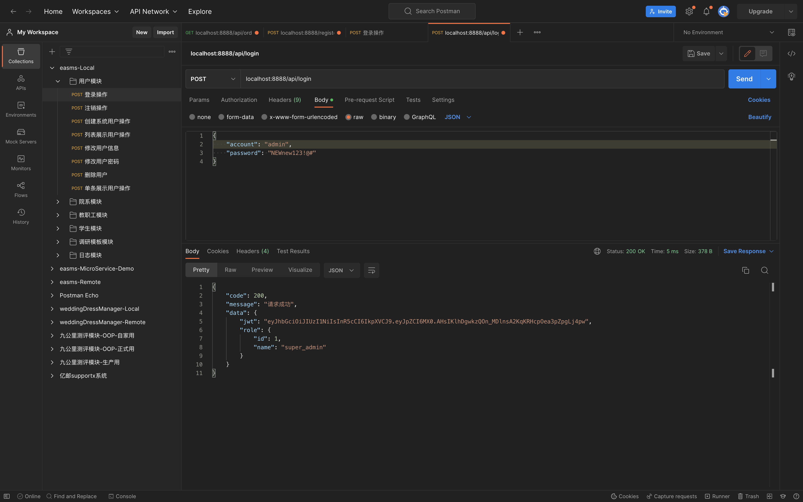
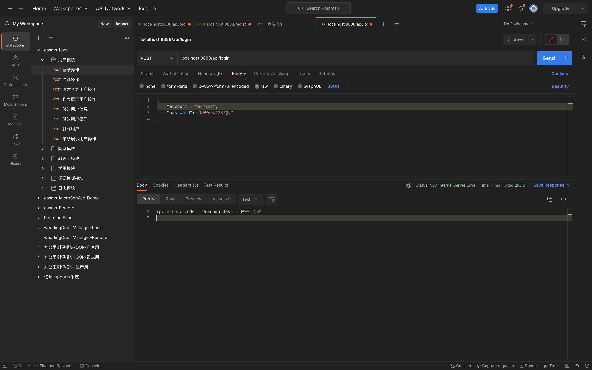

# 集成GORM

此处继续使用上一个复习章节中的代码.

## PART1. 添加配置

本例中只有user rpc服务需要访问DB,而user api服务作为api层,不需要访问DB,所以只在user rpc服务中添加连接MySQL的配置即可.

`user/etc/user.yaml`:

```yaml
Name: user.rpc
ListenOn: 0.0.0.0:8080
Etcd:
  Hosts:
  - 127.0.0.1:2379
  Key: user.rpc
MySQL:
  User: root
  Password: "123456"
  Host: "127.0.0.1"
  Port: 3306
  Database: easms
  Charset: utf8
```

## PART2. 添加配置结构体

`user/internal/config/config.go`:

```go
package config

import "github.com/zeromicro/go-zero/zrpc"

type Config struct {
	zrpc.RpcServerConf
	MySQL MySQL
}

type MySQL struct {
	User     string
	Password string
	Host     string
	Port     int
	Database string
	Charset  string
}
```

## PART3. 资源池中添加MySQL连接

`user/internal/svc/servicecontext.go`:

```go
package svc

import (
	"gorm.io/driver/mysql"
	"gorm.io/gorm"
	"gorm.io/gorm/schema"
	"strconv"
	"user/internal/config"
)

type ServiceContext struct {
	Config config.Config
	DB     *gorm.DB
}

func NewServiceContext(c config.Config) *ServiceContext {
	port := strconv.Itoa(c.MySQL.Port)
	dsn := c.MySQL.User + ":" + c.MySQL.Password + "@(" + c.MySQL.Host + ":" + port + ")/" + c.MySQL.Database + "?charset=" + c.MySQL.Charset + "&parseTime=true&loc=Local"
	db, err := gorm.Open(mysql.Open(dsn), &gorm.Config{
		NamingStrategy: schema.NamingStrategy{
			// 禁用复数表名
			SingularTable: true,
		},
	})
	if err != nil {
		panic("连接MySQL失败: " + err.Error())
	}

	return &ServiceContext{
		Config: c,
		DB:     db,
	}
}
```

## PART4. 建立模型层

新建目录`user/internal/model`,在该目录下新建文件`user.go`,代码如下:

```go
package model

import (
	"gorm.io/gorm"
	"time"
)

type User struct {
	Id            int
	Account       string
	Password      string
	UserName      string `gorm:"column:username"`
	EMail         string `gorm:"column:email"`
	Mobile        string
	RoleId        int
	LastLoginTime time.Time
	Status        string
	Sort          int
	CreatedTime   time.Time `gorm:"autoCreateTime"`
	UpdatedTime   time.Time `gorm:"autoUpdateTime"`
}

func (u *User) FindByName(db *gorm.DB) error {
	return db.Where(u).First(u).Error
}
```

该ORM对应的DDL语句为:

```sql
CREATE TABLE `user` (
  `id` int(11) NOT NULL AUTO_INCREMENT COMMENT '主键自增ID',
  `account` varchar(255) DEFAULT NULL COMMENT '登录账号',
  `password` varchar(255) DEFAULT NULL COMMENT '登录密码',
  `username` varchar(255) DEFAULT NULL COMMENT '登录密码',
  `email` varchar(255) DEFAULT NULL COMMENT '邮箱地址',
  `mobile` varchar(255) DEFAULT NULL COMMENT '电话号码',
  `role_id` int(11) DEFAULT NULL COMMENT '角色ID 即role.id',
  `last_login_time` datetime DEFAULT NULL COMMENT '最后登录时间',
  `status` enum('normal','delete') DEFAULT NULL COMMENT '用户状态 normal:正常 delete:删除',
  `sort` int(11) DEFAULT NULL COMMENT '排序字段',
  `created_time` datetime DEFAULT CURRENT_TIMESTAMP COMMENT '数据创建时间',
  `updated_time` datetime DEFAULT CURRENT_TIMESTAMP ON UPDATE CURRENT_TIMESTAMP COMMENT '数据修改时间',
  PRIMARY KEY (`id`)
) ENGINE=InnoDB AUTO_INCREMENT=2 DEFAULT CHARSET=utf8 COMMENT='用户表';
```

## PART5. 逻辑层处理

`user/internal/logic/loginlogic.go`:

```go
package logic

import (
	"context"
	"crypto/md5"
	"encoding/hex"
	"errors"
	"fmt"
	"gorm.io/gorm"
	"user/internal/model"
	"user/internal/svc"
	"user/types/user"

	"github.com/zeromicro/go-zero/core/logx"
)

type LoginLogic struct {
	ctx    context.Context
	svcCtx *svc.ServiceContext
	logx.Logger
}

func NewLoginLogic(ctx context.Context, svcCtx *svc.ServiceContext) *LoginLogic {
	return &LoginLogic{
		ctx:    ctx,
		svcCtx: svcCtx,
		Logger: logx.WithContext(ctx),
	}
}

func (l *LoginLogic) Login(in *user.LoginRequest) (*user.LoginResponse, error) {
	// todo: add your logic here and delete this line
	account := in.Account
	userOrm := &model.User{
		Account: account,
	}
	err := userOrm.FindByName(l.svcCtx.DB)
	if err != nil && !errors.Is(err, gorm.ErrRecordNotFound) {
		return nil, errors.New("查询DB失败: " + err.Error())
	}

	if errors.Is(err, gorm.ErrRecordNotFound) {
		return nil, errors.New("账号不存在")
	}

	if userOrm.Password != calcMd5(in.Password) {
		err = errors.New("密码不正确")
		return nil, err
	}
	fmt.Printf("%#v\n", userOrm)
	resp := &user.LoginResponse{
		Code:    200,
		Message: "请求成功",
		Data: &user.LoginData{
			Jwt: "eyJhbGciOiJIUzI1NiIsInR5cCI6IkpXVCJ9.eyJpZCI6MX0.AHsIKlhDgwkzQOn_MDlnsA2KqKRHcpOea3pZpgLj4pw",
			Role: &user.Role{
				Id:   int64(userOrm.Id),
				Name: "super_admin",
			},
		},
	}
	return resp, nil
}

func calcMd5(in string) string {
	h := md5.Sum([]byte(in))
	return hex.EncodeToString(h[:])
}
```

## PART6. 测试





